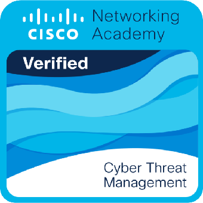

# CISCO Cyber Threat Management

> [!NOTE]
> 
> This file should be seen as a simple summary of concepts and useful solutions for the various modules.

Install **Packet Tracer** from [here](https://skillsforall.com/resources/lab-downloads?courseLang=en-US)

Tutorials:

* [Starter](https://skillsforall.com/content/varmir/1.0/m0/course/en-US/assets/1.0.7-packet-tracer---logical-and-physical-mode-exploration.pksz)

* [Diagnostic commands](https://skillsforall.com/content/varmir/1.0/m2/course/en-US/assets/2.1.7-packet-tracer-use-diagnostic-commands.pka)

---

---

## Governance

IT security governance determines who is authorized to make decisions about cybersecurity risks within an organization.

* **data owner**, ensures compliance with policies and procedures, assigns the proper classification to information assets, and determines the criteria for accessing information assets

* **data controller**, determines the purpose for which, and the way in which, personal data is processed

* **data processor**, processes data on behalf of the data controller

* **data custodian**, implements the classification and security controls for the data in accordance with the rules set out by the data owner

* **data steward**, ensures that the data supports an organization's business needs and meets regulatory requirements

* **data protection officer**, oversees an organization's data protection strategy

---

## Types of Security Policies

Every cybersecurity policy is a high-level document that outlines an organization's vision for cybersecurity, including its goals, needs, scope and responsibilities.

* **Identification and Authentication policy**, specifies who should be permitted access to network resources and what verification procedures are in place to facilitate this

* **Password policy**,

* **Acceptable use policy**, highlights a set of rules that determine access to and use of network resources

* **Remote access policy**, sets out how to remotely connect to an organization’s internal network and explains what information is remotely accessible

* **Network maintenance policy**, outlines procedures for updating an organization’s specified operating systems and end-user applications

* **Incident handling policy**

* **Data policy**, sets out measurable rules for processing data within an organization

* **Credential policy**

* **Organizational policy**, provides guidance for how work should be carried out in an organization

---

## Industry Specific laws

* **[FINANCE] Gramm-Leach-Bliley Act GLBA**

* **[CORPORATE ACCOUNTING] Sarbanes-Oxley Act SOX**

* **[CREDIT CARD] Payment Card Industry Data Security Standard PCI DSS**

---

---

# Module 1 Quiz solutions

> What do penetration tests and red team exercises achieve?
> 
> * They simulate attacks to gauge the security capabilities of an organization.

> Cybersecurity professionals may have access to sensitive data. What one 
> factor should they understand to help them make informed ethical 
> decisions in relation to this data?
> 
> * Laws governing the data

> An organization has experienced several incidents involving employees
>  downloading unauthorized software and using unauthorized websites and 
> personal USB devices.
> 
> What measures could the organization implement to manage these threats?
> 
> * Disable USB access, Provide security awareness training, and Use content filtering

> What law protects the privacy of an employee’s personal information from being shared with third parties?
> 
> * GLBA

> Which of the following principles is used by the U.S. government in its access control models?
> 
> * Need to know

> The ability to carry out highly specialized review and evaluation of 
> incoming cybersecurity information to determine if it is useful for 
> intelligence is covered in what category of the National Cybersecurity 
> Workforce Framework?
> 
> * Analyze

> What federal act law would an individual be subject to if they knowingly accessed a government computer without permission?
> 
> * CFAA

> What is the primary goal of IT security governance?
> 
> * To provide oversight to ensure that risks are adequately mitigated

> What act protects the personal information of students in schools?
> 
> * FERPA

> What is the function of the Cloud Security Alliance (CSA)?
> 
> * It provides security guidance to any organization that uses cloud computing.

> Which of the following frameworks identifies controls based on the 
> latest information about common cyber attacks and provides benchmarks 
> for various platforms?
> 
> * CIS

---

---

## Types of Scans

A vulnerability scanner assesses computers, computer systems ,networks or applications for weaknesses.

* **Network scanners**, probe hosts for open ports, enumerate information about users and groups and look for known vulnerabilities on the network

* **Application scanners**, access application source code to test an application

* **Web application scanners**, identify vulnerabilities in web apps

---

* **Intrusive scans**, try to exploit vulnerabilities and may even crash the target

* **Non-intrusive scans**, try not to cause harm to the target

---

* **Credentialed scan**, allow the scanner to harvest more information *(acts as a logged in user)*

* **Non-credentialed scan**, it's an outsider's point of view

---

## Security Automation

* **Security Information and Event Management [SIEM]**, uses log collectors to aggregate log data from sources. Logs can generate many events in a day, SIEM helps reducing the number of events.
  
  *"It identifies internal and external threats, monitors activity and resource usage, conducts compliance reporting for audits and supports incident response"*

* **Orchestration Automation and Response [SOAR]**, allows to collect data about security threats from various sources, and responds to low-level events without the human intervention.
  
  *"It manages threats and vulnerabilities, allows to Security incident response, and Security operations automation"*

---

## Network Testing Tools

* **Nmap / Zenmap**, used to discover computers and their services on a network

* **SuperScan**, port scanning software designed to detect open *TCP* and *UDP* ports, relative services, and to run queries, such as `whoami`, `ping`, `traceroute` and hostname lookups

* **Security Information Event Management [SIEM]**, used in enterprise organizations to provide real time reporting and long-term analysis of security events

* **GFI LANguard**, network and security scanner which detects vulnerabilities

* **Tripwire**, assesses and validates IT configurations against internal policies, compliance standards, and security best practices

* **Nessus**, vulnerability scanner software, focusing on remote access, misconfigurations, and DoS against TCP/IP stack

* **L0phtCrack**, password auditing and recovery application

* **Metasploit**, provides information about vulnerabilities and aids in penetration testing and IDS signature developing

---

## Pentesting

It is a way of testing areas of weaknesses in systems by using various malicious techniques.

**Levels of pentesting:**

* **Black box testing**, the specialist has no knowledge of the inner workings of the system, and attempts to attack it from the *viewpoint of a regular user*
  
  **+ least time consuming            + least expensive**

* **White box testing**, carried out by a specialist with knowledge of how the system works. It emulates a malicious attack by an insider or by someone who has managed to gain such information beforehand, at the recon stage
  
  **- most time consuming             - most expensive**

* **Grey box testing**, it is a combination of white and black testing; specialist has some advantage on the hacking attempts because he has some limited knowledge about the system

**Phases:**

* **Planning**

* **Discovery**

* **Attack**

* **Reporting**

[Wireshark Lab](wiresharklab.html)

### Active reconnaissance

It involves more direct probing and interaction with the target to gather information, potentially including attempting to crack passwords through various means.

### Passive reconnaissance

It gathers information without directly interacting, often leveraging publicly available data.

---

---

# Module 2 Quiz solutions

> What describes a feature of credentialed scans?
> 
> * They return fewer false positives and fewer false negatives.

> What network testing tool is used for password auditing and recovery?
> 
> * L0phtcrack

> An administrator is troubleshooting NetBIOS name resolution on a Windows PC. What command line utility can be used to do this?
> 
> * nbtstat

> What is the purpose of the Tripwire network testing tool?
> 
> * to assess configuration against established policies, recommended best practices, and compliance standards

> An organization has hired a former hacker to test how well the organization would tolerate a real attack by using malicious techniques. What type of testing is the hacker performing for the organization?
> 
> * penetration

> How does network scanning help assess operations security?
> 
> * It can detect open TCP ports on network systems.

> What network scanning tool has advanced features that allows it to use decoy hosts to mask the source of the scan?
> 
> * Nmap

> A new technician was overheard telling colleagues that a secure network password had been discovered through a search of social media sites. What technique was used to acquire the password?
> 
> * passive reconnaissance

> The laptop of an attacker is attached to a corporate network. The attacker is examining all of the network traffic that is passing through the network interface card. Which network reconnaissance method does this scenario describe?
> 
> * sniffing

> Which approach provides automated tools allowing an organization to collect data about security threats from various sources?
> 
> * SOAR

> A new person has joined the security operations team for a manufacturing plant. What is a common scope of responsibility for this person?
> 
> * day-to-day maintenance of network security

> Which penetration test phase is concerned with conducting reconnaissance to gain information about the target network or device?
> 
> * discovery

> Which cybersecurity weapon scans for use of default passwords, missing patches, open ports, misconfigurations, and active IP addresses?
> 
> * vulnerability scanners

---

---

# Threat Intelligence

## Network intelligence communities

* **SANS (SysAdmin, Audit, Network, Security institute)**, contains a large collection of free resources about cybersec research papers, news articles and RISK (discovered attacks and their explanation)

* **Miltre corporation**, maintain a list of common vulnerabilities and exposures **CVEs**

* **FIRST (Forum of Incident Response and Security Teams)** is a security organization that allows cooperation and coordination in information sharing, incident prevention and rapid reaction

* **(ISC)**$^2$ is the International Information Systems Security Certification Consortium that provides vendor neutral education products and career services

* **CIS (Center of Internet Security)**, provides a 24x7 cyber threat warnings ans advisories, vulnerability identification, and mitigation and incident response; It represents a focal point for state, local, tribal, and territorial [SLTT] governments

---

## CISCO Talos

It is a service that allows the exchange of threat information such as vulnerabilities, indicators of compromise (IOC), and mitigation techniques. As threats emerge, threat intelligence services create and distribute firewall rules and ICOs to the devices that have subscribed to the service.

---

## FireEye

It offers SIEM and SOAR with the Helix Security Platform, which uses behavioral analysis and advanced threat detection and is supported by the FireEye Mandiant worldwide threat intelligence network.

---

## Automated Indicator Sharing

It is offered by the U.S. Department of Homeland Security, it enables the real-time exchange of cyber threat indicators between the private sector and the U.S. Federal Government.

---

---

---

# Module 3 Quiz solutions

> What is the primary function of (ISC2)?
> 
> * to provide vendor neutral education products and career services

> What is the primary function of SANS?
> 
> * to maintain the Internet Storm Center

> What is the primary function of the Center for Internet Security (CIS)?
> 
> * to offer 24x7 cyberthreat warnings and advisories, vulnerability identification, and mitigation and incident responses

> What is the primary purpose of the Forum of Incident Response and Security Teams (FIRST)?
> 
> * to enable a variety of computer security incident response teams to collaborate, cooperate, and coordinate information sharing, incident prevention, and rapid reaction strategies

> Which service is offered by the U.S. Department of Homeland Security (DHS) that enables real-time exchange of cyberthreat indicators between the U.S. Federal Government and the private sector?
> 
> * AIS

> What does the MITRE Corporation create and maintain?
> 
> * CVE

> Which threat intelligence sharing open standard specifies, captures, characterizes, and communicates events and properties of network operations?
> 
> * CybOX

> What is the primary objective of a threat intelligence platform (TIP)?
> 
> * to aggregate the data in one place and present it in a comprehensible and usable format

> How does FireEye detect and prevent zero-day attacks?
> 
> * by addressing all stages of an attack lifecycle with a signature-less engine utilizing stateful attack analysis

> Which service is provided by the Cisco Talos Group?
> 
> * collecting information about active, existing, and emerging threats

---

---

# Endpoint Vulnerability Assessment

## Network profiling

Networks, servers, and hosts exhibit typical behavior for a given point in time. Network and device profiling can provide a statistical baseline that serves as a reference point. Unexplained deviations from the baseline may indicate a compromise.

Rises in network utilization during periodic server backup operations is part of normal network functioning and should be part of the baseline data.

Baseline should not include performance data.

A means of capturing just the right period for baseline measurement is known as sliding window anomaly detection; it defines a window that is most representative of network operation and deletes data that is out of date.

Increased utilization of WAN links at unusual times can indicate a network breach and exfiltration of data. Hosts that begin to access obscure internet servers, resolve domains that are obtained through dynamic DNS, or use protocols or services that
 are not needed by the system user can also indicate compromise. Deviations in network behavior are difficult to detect if normal behavior is not known.

**Tools for characterize normal network traffic:**

* **NetFlow**

* **Wireshark**

| Network profile element          | Description                                                                                 |
| -------------------------------- | ------------------------------------------------------------------------------------------- |
| **Session duration**             | time between the establishment of a data flow and its termination                           |
| **total Throughput**             | amount of data passing from a given source to a given destination in a given period of time |
| **Ports used**                   | list of TCP or UDP that are available                                                       |
| **Critical asset address space** | IP addresses or the logical location of essential systems or data                           |

A user who suddenly begins logging in to the network at strange times from a remote location should raise alarms if this behavior is a deviation from a known norm.

---

## Server profiling

A server profile is a security baseline for a given server. It establishes the network, user, and application parameters that are accepted for a specific server.

To establish the server profile, we need to understand the function that a server is intended to perform in a network.

| Server profile element           | Description                                                                          |
| -------------------------------- | ------------------------------------------------------------------------------------ |
| **Listening ports**              | The TCP and UDP deamons and ports that are normally allowed to be open on the server |
| **Logged in users and accounts** | Parameters defining user access and behavior                                         |
| **Service accounts**             | Type of service that an application is allowed to run                                |
| **Software environment**         | Tasks, processes, and applications that are permitted to run on the server           |

---

## Network Anomaly Detection

Network behavior is described by a large amount of diverse data such as the packet flow, features of the packets themselves, and telemetry fro multiple sources.

**Network Behavior Analysis [NBA]** is the analysis of this diverse, unstructured data using big data analytics techniques. It uses sophisticated statistical and machine learning techniques to compare normal performance baselines with network performance at a given time.

---

## Network Vulnerability Testing

* **Risk Analysis**, analysts evaluate the risk posed by vulnerabilities to a specific organization; it includes assessment of the likelihood of attacks, identifies types of likely threat actors, and evaluates the impact of successful exploits on the organization
  
  * carried out by internal or external consultants, risk management frameworks

* **Vulnerability Assessment**, this test employs software to scan internet facing servers and internal networks for various types of vulnerabilities. These vulnerabilities include unknown infections, weaknesses in web-facing database services, missing software patches, unnecessary listening ports, etc.
  
  * Openvas, Microsoft, Baseline Analyzer, Nessus, Qualys, Nmap

* **Penetration testing**
  
  * Metasploit, CORE Impact, ethical hackers

---

## Common Vulnerability Scoring System [CVSS]

It is a risk assessment tool that is designed to convey the common attributes and severity of vulnerabilities in computer HW and SW.

**Benefits:**

* it provides standardized vulnerability scores that should be meaningful across organizations

* it provides an open framework with the meaning of each metric openly available to all users

* it helps prioritize risk

### CVSS Metric groups

**Basic metric group** represents the characteristics of a vulnerability that are constant over time and across contexts; has 2 classes of metrics:

* **Exploitability**, features of the exploit required

* **Impact metrics**, impact of the exploit rooted in the CIA triad

| Criteria                | Description                                                                                                                                                                      |
| ----------------------- | -------------------------------------------------------------------------------------------------------------------------------------------------------------------------------- |
| **Attack vector**       | reflects the proximity of the threat actor to the vulnerable component; the more remote the actor the higher the severity (more difficult to remediate)                          |
| **Attack complexity**   | Expresses the number of components, software, hardware, or networks, that are beyond the attacker's control and must be present for a vulnerability to be successfully exploited |
| **Privileges required** | Level of access that is required for a successful exploit of the vulnerability                                                                                                   |
| **User interaction**    | Presence or Absence of the requirement for a user interaction                                                                                                                    |
| **Scope**               | Expresses whether multiple authorities must be involved in an exploit; != NULL if the initial authority changes to a second authority during the exploit                         |

**Temporal metric group** represents the characteristics of a vulnerability that can change over time, but not across user environment. Over time the severity can change (can get bad or good, based on patches and countermeasures used).

**Environmental metric group**, measures the aspects of a vulnerability that are rooted in a specific organization's environment.

---

## Risk Management

* **Risk avoidance**
  
  * Stop performing the activities that create risk
  
  * After risk assessment, the risk involved in an activity outweighs the benefit of the activity -> the activity must be discontinued

* **Risk reduction**
  
  * Take measures to reduce vulnerability
  
  * Change management approaches

* **Risk sharing**
  
  * Shift some of the risk to other parties
  
  * Security services can be hired to perform security monitoring, for example (SECaaS) CSIRT
  
  * Use insurances

* **Risk retention**
  
  * Accept the risk and its consequences

---

## Vulnerability Management

* **Discover**
  
  Inventory all assets across the network and identify host details, including operating systems and open services, to identify vulnerabilities. Develop a network baseline. Identify security vulnerabilities on a regular automated schedule.

* **Prioritize Assets**
  
  Categorize assets into groups or business units, and assign a business value to asset groups based on their criticality to business operations.

* **Assess**
  
  Determine a baseline risk profile

* **Report**

* **Remediate**

* **Verify**
  
  Verify that threats have been eliminated through follow-up audits

---

## Patch Management Techniques

### Agent-based

A software agent must be running on each host to be patched. The agent monitors and reports vulnerable software installed on the host.

It communicates with a patch manager server and install new patches from the server.

Preferred for mobile devices.

### Agentless Scanning

Patch manager servers scans the network for devices that require patching.

Only devices that are on scanned network segments can be patched in this way.

### Passive network monitoring

Device requiring patching are identified through the monitoring of the traffic on the network. Effective only for software that includes version information in its network traffic.

---

---

# Module 4 Quiz solutions

> n profiling a server, what defines what an application is allowed to do or run on  server?
> 
> * service accounts

> In network security assessments, which type of test is used to evaluate the risk posed by vulnerabilities to a specific organization including assessment of the likelihood of attacks and the impact of successful exploits on the organization?
> 
> * penetration testing

> When a network baseline is being established for an organization, which network profile element indicates the time between the establishment of a  data flow and its termination?
> 
> * session duration

> Which type of evaluation includes the assessment of the likelihood of an attack, the type of threat actor likely to perpetrate such an attack, and what the consequences could be to the organization if the exploit is successful?
> 
> * risk analysis

> A cybersecurity analyst is performing a CVSS assessment on an attack where a web link was sent to several employees. Once clicked, an internal attack was launched. Which CVSS Base Metric Group Exploitability metric is used to document that the user had to click on the link in order for the attack to occur?
> 
> * user interaction

> Which metric class in the CVSS Basic Metric Group identifies the impacts on confidentiality, integrity, and availability?
> 
> * Impact

> Which metric in the CVSS Base Metric Group is used with an attack vector?
> 
> * the proximity of the threat actor to the vulnerability

> Which statement describes the threat-vulnerability (T-V) pairing?
> 
> * It is the identification of threats and vulnerabilities and the matching of threats with vulnerabilities.

> In addressing an identified risk, which strategy aims to shift some of the risk to other parties?
> 
> * risk sharing

> Which step in the Vulnerability Management Life Cycle categorizes assets into groups or business units, and assigns a business value to asset groups based on their criticality to business operations?
> 
> * prioritize assets

> What is an action that should be taken in the discovery step of the vulnerability management life cycle?
> 
> * developing a network baseline

---

---

# Risk Management and Security Controls

It is a formal process that measures the impact of a threat and the cost to implement controls or countermeasures to mitigate that threat. All organizations accept some risk and the cost of a counter measure should not be more than the value of the asset being protected.

## Risk Management

### Frame the risk

We need to identify the threats throughout the organization that increase risk. Threats identified include loss or damage of processes and products, attacks, potential failure or disruption of services, harm to the organization's reputation, legal liability, and loss of intellectual property.

### Assess the risk

Once a risk has been identified, it is assessed and analyzed to determine the severity that the threat poses. Risk can be prioritized by actual financial impact (quantitative analysis) or scaled impact on the organization's operation (qualitative analysis).

### Respond to the risk

Develop an action plan to reduce overall organization risk exposure. Risk can be eliminated, mitigated, transferred, or accepted.

### Monitor the risk

Not all risks can be eliminated, so threats that are accepted need to be closely monitored. An organization can use a risk registry that contains details about the risk and the controls implemented or response strategies used.

---

## Risk Assessment

Organizations assess and examine their operational risks by performing a risk assessment to ensure their risk management meets all their business objectives.

### Threat source types

A threat is the potential that a vulnerability will be identified and exploited, while a threat vector is the path an attacker utilizes to impact the target.

A threat can be internal and external or/and :

* **Adversarial**, threats from individuals, groups, organizations or nations

* **Accidental**, actions that occur without a malicious intent

* **Structural**, equipment and software failures

* **Environmental**, external disasters that can be either natural or human-caused, such as fires and floods

## Risk Analysis

It examines the dangers posed by natural and human-caused events to the assets of an organization. A user performs an asset identification to help determine which assets to protect.

1. Identify assets and their value

2. Identify vulnerabilities and threats

3. Quantify the probability and impact of the identified threats

4. Balance the impact of the threat against the cost of the countermeasure

### Quantitative risk analysis

It assigns numbers to the risk analysis process. "Used in economic analysis, considering the asset value"

### Qualitative risk analysis

It considers the opinions and scenarios plotting a likelihood of a threat against it. "Server failure may be likely, but its impact may only be marginal"

---

## Control types

* **Administrative controls** consist of procedures and policies that an organization puts into place when dealing with sensitive information [how the people act]

* **Technical controls** involve hardware and/or software implemented to manage risk and provide protection

* **Physical controls** are mechanisms such as fences and locks deployed to protect systems, facilities, personnel and resources [separate people or other threats from systems]

## Functional security controls

* **Preventive controls** stop unwanted and unauthorized activity from happening and/or apply restrictions for authorized users

* **Deterrent controls** aim to discourage something from happening; limit or mitigate an action or behavior

* **Detective controls** identifies different types of unauthorized activity

* **Corrective controls**

* **Recovery controls** restore resources, functions and capabilities after a violation of a security policy

* **Compensative controls** provide options to other controls to bolster enforcement in support of a security policy

### Center of Internet Security [CIS]

It has created a mapping of 18 critical security controls to some of the common compliance frameworks. In order to provide guidance to security professionals.

---

---

# Module 5 Quiz solutions

> As part of HR policy in a company, an individual may opt-out of having information shared with any third party other than the employer. Which law protects the privacy of personal shared information?
> 
> * GLBA

> Which threat is mitigated through user awareness training and tying security awareness to performance reviews?
> 
> * user-related threats

> A breach occurs in a company that processes credit card information. Which industry specific law governs credit card data protection?
> 
> * PCI DSS

> A company has had several incidents involving users downloading unauthorized software, using unauthorized websites, and using personal USB devices. The CIO wants to put in place a scheme to manage the user threats. What three things might be put in place to manage the threats?
> 
> * Use content filtering, Provide security awareness training, Disable CD and USB access

> What is the workforce framework category that includes highly specialized review and evaluation of incoming cybersecurity information to determine if it is useful for intelligence?
> 
> * Analyze

> A security professional is asked to perform an analysis of the current state of a company network. What tool would the security professional use to scan the network only for security risks?
> 
> * vulnerability scanner

> What type of network security test uses simulated attacks to determine the feasibility of an attack as well as the possible consequences if the attack occurs?
> 
> * penetration testing

> What information does the SIEM network security management tool provide to network administrators?
> 
> * real time reporting and analysis of security events

> What network testing tool would an administrator use to assess and validate system configurations against security policies and compliance standards?
> 
> * Tripwire

> What type of network security test can detect and report changes made to network systems?
> 
> * integrity checking

> Which organization defines unique CVE Identifiers for publicly known information-security vulnerabilities that make it easier to share data?
> 
> * MITRE

> Which statement describes Trusted Automated Exchange of Indicator Information (TAXII)?
> 
> * It is the specification for an application layer protocol that allows the communication of CTI over HTTPS.

> How does AIS address a newly discovered threat?
> 
> * by enabling real-time exchange of cyberthreat indicators with U.S. Federal Government and the private sector

> Which security management plan specifies a component that involves tracking the location and configuration of networked devices and software across an enterprise?
> 
> * asset management

> Which step in the Vulnerability Management Life Cycle determines a baseline risk profile to eliminate risks based on asset criticality, vulnerability threat, and asset classification?
> 
> * assess

> What are the three impact metrics contained in the CVSS 3.0 Base Metric Group?
> 
> * confidentiality, availability, integrity

> When establishing a network profile for an organization, which element describes the time between the establishment of a data flow and its termination?
> 
> * session duration

> In addressing an identified risk, which strategy aims to decrease the risk by taking measures to reduce vulnerability?
> 
> * risk reduction

> Which risk mitigation strategies include outsourcing services and purchasing insurance?
> 
> * transfer

> In which situation would a detective control be warranted?
> 
> * when the organization needs to look for prohibited activity

> The team is in the process of performing a risk analysis on the database services. The  information collected includes the initial value of these assets, the threats to the assets and the impact of the threats. What type of risk analysis is the team performing by calculating the annual loss expectancy?
> 
> * quantitative analysis

> Based on the risk management process, what should the cybersecurity team
>  do as the next step when a cybersecurity risk is identified?
> 
> * assess the risk

> Why would an organization perform a quantitative risk analysis for network security threats?
> 
> * so that the organization can focus resources where they are most needed

> Which two values are required to calculate annual loss expectancy?
> 
> * single loss expectancy, annual rate of occurrence

---

---

# Digital Forensics and Incident Analysis and Response

## Digital Forensics process

1. **Collection**, it is the identification of potential sources of forensic data and acquisition, handling, and storage of that data. [Don't damage, lose, or omit important data]

2. **Examination**, consists in assessing and extracting relevant information from the collected data. This may involve decompression or decryption of the data. [Identify relevant data in relevant and sparse data]

3. **Analysis**, drawing conclusions from the data

4. **Reporting**, prepare and present information that resulted from the analysis

## Evidence collection

**IETF RFC 3227** provides guidelines for the collection of digital evidence. It describes the order for the collection of digital evidence based on the volatility of the data.

## Chain of Custody

An accused individual can say that the evidences have been altered or fabricated after being collected. In order to counter this argument, a rigorous chain of custody must be defined:

* Who discovered and collected the evidence?

* Details about the handling of evidence including times, places, and personnel involved

* Who has the primary responsibility for the evidence, when responsibility was assigned, and when custody changed?

* Who has physical access to the evidence while it was stored?

## MITRE ATT&CK framework

It is a framework for detect attacker tactics, techniques, and procedures [TTP] as part of threat defense and attack attribution. This is done by mapping the steps in an attack to a matrix of generalized tactics and describing the techniques that are used in each tactic.

This framework is a global knowledge base of threat actor behavior.

---

**Gather system information after incident Lab:** [here](gathersysinfolab.html)

---

## Cyber Kill Chain

It was developed by Lockheed Martin to identify and prevent cyber intrusions. The Cyber Kill Chain specifies what an attacker must complete to accomplish their goal.

If the attacker is stopped at any stage, the chain of attack is broken.

### 1- Reconnaissance

It is when the threat actor performs research, gathers intelligence and select targets.

The threat actor will choose targets that have been neglected or unprotected because they will have a higher likelihood of becoming penetrated and compromised.

### 2- Weaponization

The goal of this step is to use the information from reconnaissance to develop a weapon against a specific targeted systems or individuals in the organization.

The threat actor needs to look at what attacks are available for the vulnerabilities they have discovered.

### 3- Delivery

The weapon is transmitted to the target using a delivery vector. This may be through the use of a website, removable USB media, or an email attachment.

### 4- Exploitation

After the weapon has been delivered, the threat actor uses it to break the vulnerability and gain control of the target.

### 5- Installation

When the threat actor establishes a back door into the system to allow for continued access to the target.

### 6- Command & Control [CnC]

The goal is to establish command and control with the target system. Compromised hosts usually beacon out of the network to a controller on the internet. CnC channels are used by the threat actor to issue commands to the software that they installed on the target.

### 7- Actions on Objectives

The threat actor achieves his original objective.

---

## Diamond Model

It is a model of Intrusion analysis made up of four parts. the model represents a security incident or event. An event is a time-bound activity that is restricted to a specific step in which an adversary uses a capability in order to attack a victim.

* **Adversary**, threat actor

* **Infrastructure**, network path used for the exploit

* **Victim**, can be a person, resource, or asset

* **Capability**, tools and techniques used by an adversary

*"The adversary uses the infrastructure to connect to the victim. The adversary develops capability to exploit the victim"*

**Important elements:**

* `Timestamp`, start and stop time of an event

* `Phase`, similar to the steps in the Cyber Kill Chain; malicious activities includes two or more steps executed

* `Result` compromised [confidentiality, integrity, and availability]

* `Direction`, [Adv-to-Infra, Infra-to-Victim, Victim-to-Infra, and Infra-to-Adv]

* `Methodology`, general classification for the event, such as port scan, phishing, content delivery attack, syn flood etc.

* `Resources`
  
  * external sources: software, adversary's knowledge, and information
  
  * assets to carry out the attack: hardware, funds, facilities, network access

### Illustrate an attack using the Diamond model

### Diamond Model and Cyber Kill Chain

Adversaries do not operate in just a single event. Instead, events are threaded together in a chain in which each event must be successfully completed before the next event.

This thread of events can be mapped using the Cyber Kill Chain.

Every event can be modeled using the Diamond Model.

Attack analysis lab: [here](attlab.html)

---

## Incident Response

Incident response involves the methods, policies, and procedures that are used by an organization to respond to a cyberattack. The aims of incident response are to limit the impact of the attack, assess the damage caused, and implement recovery procedures.

The **NIST 800-61r2** provides guidelines for incident handling.

The first step for an organization is to establish a **computer security incident response capability [CSIRC]**. NIST recommends creating policies, plans, and procedures for establishing and maintaining a CSIRC:

* **Policies elements** must be reviewed regularly to adjust it to meet the goals of the roadmap that has been laid out. It is composed by:
  
  * Statement of management commitment
  
  * Purpose and objectives of the policy
  
  * Scope of the policy
  
  * Definition of computer security incidents and related terms
  
  * Organizational structure and definition of roles, responsibilities, and levels of authority
  
  * Prioritization of severity ratings of incidents
  
  * Performance measures
  
  * Reporting and contact forms

* **Plan elements** will ensure that each party involved in the incident response has a clear understanding of not only what they will be doing, but what others will be doing as well. Those are the elements:
  
  * Mission
  
  * Strategies and goals
  
  * Senior management approval
  
  * Organizational approach to incident response
  
  * Communication methods used by incident response team with the organization and other organizations
  
  * Metrics for measuring the incident response capability
  
  * How the program fits into overall organization

* **Procedure elements** are followed during an incident response and must follow the incident response plan. Composed by:
  
  * Technical processes
  
  * Using techniques
  
  * Filling out forms
  
  * Following checklists
  
  Those are typical **standard operating procedures [SOPs]** that minimize errors that may be caused by personnel that are under stress while participating in incident handling.

## Incident response Stakeholders

**Managers** create the policies that everyone must follow. Management must coordinate the incident response with other stakeholders.

**Information Assurance** are needed in order to change things such as firewalls rules during some stages of incident management such as containment or recovery.

**IT Support** are the most useful figure, because they work with the technology in the organization.

**Legal department** must be involved during the procedures and for reviewing the policies and plans.

**Public affairs and Media relations** useful for informing the public.

**Human Resources** needed to perform disciplinary measures if an incident caused by an employee occurs.

**Business Continuity Planners**

**Physical Security and Facilities Management**

---

## Cybersecurity Maturity Model Certification [CMMC]

It is a framework created to assess the ability of an organization that perform functions for the U.S. Department of Defense to protect the military supply chain.

Divided by levels *"the more, the better"*:

2. Basic NIST process, detect, report, and prioritize events

3. Report incidents with documents to all stakeholders + test of capabilities

4. Use "knowledge of attacker tactics, techniques, and procedures [TTP]" to refine incident response planning and execution + security operation center [SOC] 24/7

5. Use computer forensic data gathering techniques including the secure handling and storage of forensic data. Use manual and automated real-time responses to potential incidents (using known patterns)

---

## NIST incident response

1. **Preparation**
   
   Members of the CSIRT should continually develop knowledge of emerging threats.
   
   * It must allow communication between people, for example stakeholders, other CSIRTs, and law enforcement ...
   
   * Facilities to host the response team and the SOC are created
   
   * HW and SW for incident analysis and mitigation must be acquired
   
   * Risk assessments are used to implement controls that will limit the number of incidents
   
   * Validation of security hardware and software deployment is performed on end-user devices, servers, and network devices
   
   * Training material must be update
   
   * List of critical assets, network diagrams, port lists, hashes of critical files, and baseline readings of system and network activity
   
   * clean OS images and application installation files may be needed for recover a computer from an incident

2. **Detection and Analysis**
   
   CSIRT must identify, analyze and validate an incident.
   
   * **Attack vectors**, Web, Email, Loss or Theft, Impersonation, Attrition (brute force), and Media (external storage/removable media)
   
   * **Detection**, must determine the type of incident and the extent of the effect; there are two categories for the signs of an incident:
     
     * *Precursor*, sign that an incident can occur in the future.
     
     * *Indicator*, sign that an incident might already have occurred or is currently occuring
   
   * **Analysis**, using predefined process and documenting each step, it is possible to find useful metrics for known indicators
   
   * **Scoping**, networks, systems, or application are the incident's scope
   
   * **Incident Notification**, incident response teams need to notify the appropriate stakeholdes

3. **Containment, Eradication, and Recovery**
   
   CSIRT implements procedures to contain the threat, eradicate the impact on organizational assets, and use backups to restore data and software (in necessary re-start from 2).
   
   * **Containment Strategy**, how to contain the threat? Many times it is impossible to directly unplug the compromised host from the network.
   
   * **Evidence**, Logging is vital, those are the most important items to log when documenting evidence used in the chain custody:
     
     * Location of the recovery and Storage of all evidence
     
     * Identifying criteria for all evidence such as serial number, MAC, hostname and IP
     
     * Identification information for all the people that participated in collecting or handling the evidence
     
     * Time and Date for each evidence

4. **Post-Incident Activities**
   
   CSIRT documents how the incident wad handled, recommends changes for future responses and how to avoid reoccurrence.

---

## Incident Data Collection and Retention

The collection of vital evidences and other data is an important priority. Following the *step 3 of the NIST response life cycle* it is possible to collect all the important logs,. ...

There should be a policy in place in each organization that outlines how long the evidence of an incident is retained [months-years]. Compliance regulation may mandate the retention period. 

Factor for evidence retention:

* **Prosecution**, the attacker will be prosecuted because of a security incident, the evidence should be retained until after all legal actions have been completed

* **Data Type**, Specific type of data should be kept for a specific period of time

* **Cost** the bigger the expensive

---

# Disaster Recovery

Types of disasters:

* **Natural disasters** differ depending on location and are sometimes difficult to predict. They can be Geological, Meteorological, Heath disasters, and Miscellaneous disasters such as fires, floods, solar storm and avalanches

* **Human-caused disasters** involve people or organizations and fall into the Labor events (strikes), Sociopolitical (vandalism, sabotage), Materials events such as hazardous spills and fires, and Utility disruptions such as power failures, communications outages, ...

## Disaster Recovery Plan [DRP]

It includes the activities the organization takes to assess, salvage, repair and restore damaged facilities or assets

## Disaster Recovery Controls

Minimize the effects of a disaster so that the organization can resume operation

* **Preventive controls** that prevent a disaster from occurring (identify and mitigate risk)

* **Detective controls** that discover unwanted events, uncovering new potential threats

* **Corrective controls** for restoring the systems after a disaster or an event

---

## Business Continuity Planning [BCP]

It is a broader plan than a disaster recovery plan because it can include getting critical systems to another location while repair of the original facility is underway.

In order to have a BCP a Business Impact Analysis [BIA] is needed so we can have the identification of critical business processes, resources and relationships between systems. BIA focuses on the consequences of the interruption to critical business functions and examines the key consideration listed here:

* Recovery Time Objectives [RTO], maximum tolerable length of time that a system, network or application can be unavailable

* Recovery Point Objectives [RPOs], avg lifespan of a given asset before it fails

* Mean Time of Repair [MTTR]

* Mean Time between Failures [MTBF], avg time that elapses between one failure and the next

### Exercising your disaster recovery plan

There are several different methods available to train staff and test the organization's disaster recovery plan:

* **Tabletop**, It is a discussion in which participants sit around a table with a facilitator who supplies information related to a scenario incident and processes that are being examined

* **Functional** test where certain aspects of a plan are tested to see how well they work (how well-prepared personnel is)

* **Operational** exercises, or simulations. These are designed to interrupt services to verify that all aspects of a plan are in place and sufficient to respond

---

---

# Module 6 Quiz solutions

> Keeping data backups offsite is an example of which type of disaster recovery control?
> 
> * preventive

> What type of exercise interrupts services to verify that all aspects of a business continuity plan are able to respond to a certain type of incident?
> 
> * Operational exercise

> According to NIST, which step in the digital forensics process involves identifying potential sources of forensic data, its acquisition, handling, and storage?
> 
> * collection

> Which activity is typically performed by a threat actor in the installation phase the Cyber Kill Chain?
> 
> * Install a web shell on the target web server for persistent access.

> What is specified in the plan element of the NIST incident response plan?
> 
> * metrics for measuring the incident response capability and effectiveness

> Which NIST-defined incident response stakeholder is responsible for coordinating incident response with other stakeholders and minimizing the damage of an incident?
> 
> * management

> A cybersecurity analyst has been called to a crime scene that contains several technology items including a computer. Which technique will be used so that the information found on the computer can be used in court?
> 
> * unaltered disk image

> Which type of evidence supports an assertion based on previously obtained evidence?
> 
> * corroborating evidence

> What is a chain of custody?
> 
> * the documentation surrounding the preservation of evidence related to an incident

> What will a threat actor do to create a back door on a compromised target according to the Cyber Kill Chain model?
> 
> * Add services and autorun keys

> In which step of the NIST incident response process does the CSIRT perform an analysis to determine which networks, systems, or applications are affected; who or what originated the incident; and how the incident is occurring?
> 
> * scoping

> Which type of controls restore the system after a disaster or an event?
> 
> * Corrective controls

> Which type of data would be considered an example of volatile data?
> 
> * memory registers

> What is the objective the threat actor in establishing a two-way communication channel between the target system and a CnC infrastructure?
> 
> * to allow the threat actor to issue commands to the software that is installed on the target

> A company is applying the NIST.SP800-61 r2 incident handling process to security events. What are two examples of incidents that are in the category of precursor? (Choose two.)
> 
> * log entries that show a response to a port scan, a newly-discovered vulnerability in Apache web servers

> According to the Cyber Kill Chain model, after a weapon is delivered to a targeted system, what is the next step that a threat actor would take?
> 
> * exploitation

> Which task describes threat attribution?
> 
> * determining who is responsible for the attack

---

---

@Author: [RiccardoRobb (Robb) · GitHub](https://github.com/RiccardoRobb)
