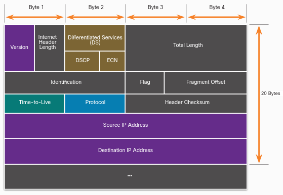
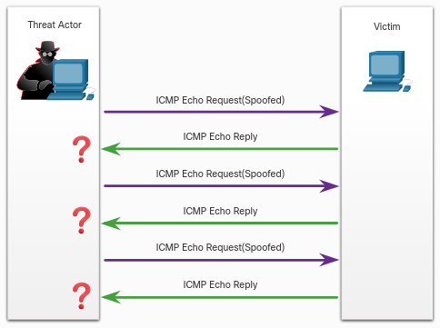
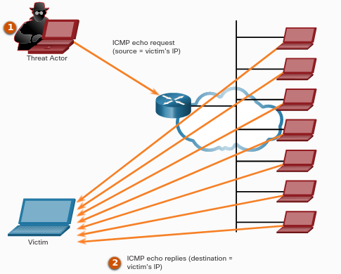

# CISCO Endpoint Security

## "This file should be seen as a simple summary of concepts and useful solutions for the various modules."

Install **Packet Tracer** from [here](https://skillsforall.com/resources/lab-downloads?courseLang=en-US)

Tutorials:

* [Starter](https://skillsforall.com/content/varmir/1.0/m0/course/en-US/assets/1.0.7-packet-tracer---logical-and-physical-mode-exploration.pksz)

## Threats

* **Software attacks**, a successful denial-of-service [DoS attack] or a computer virus

* **Software errors**, bugs, an application going offline or a cross-site script or illegal file server share

* **Sabotage**, an authorized user successfully penetrating and compromising an organization's primary database or the defacement of an organization's website

* **Human error**, inadvertent data entry errors or a firewall misconfiguration

* **Theft**, devices being stolen from an unlocked room

* **Hardware failures**

* **Utility interruption**, electrical power outages or water damage resulting from sprinkler failure

* **Natural disasters**

## Internal Vs External Threats

**Internal threats** are usually carried out by current or former employees and other contract partners.

**External threats** typically stems from amateur or skilled attackers

## User Threats and Vulnerabilities

A **User domain** includes anyone with access to an organization's information system. Users are considered the weakest link in information security systems.

* **No awareness of security**
  
  Users must be aware of and understand an organization's sensitive data, security policies and procedures.

* **Poorly enforced security policies**
  
  Security policies must be known be all the users.

* **Data theft**

* **Unauthorized downloads and media**
  
  Users must not download from the web or from removable devices.

* **Unauthorized virtual private network [VPNs]**
  
  Users must not use VPNs.

* **Unauthorized websites**

* **Destruction of systems, applications or data**
  
  Activists or competitors can delete or destroy data and devices.

---

### Backdoor

Backdoor programs such as Netbus and Back Orifice, are used by cyber criminals to gain unauthorized access to a system by bypassing the normal authentication procedures.

Users inside the organization must run a **remote administrative tool program [RAT]** in order to install the backdoor.

### Rootkit

It modifies the operating system to create a backdoor, which attackers can then use to access the computer remotely.

Using privilege escalation they can modify all kinds of system files and also system forensics and monitoring tools.

---

## Social Engineering

It is a non-technical strategy that attempts to manipulate individuals into performing certain actions or divulging confidential information.

* **Pretexting**, an individual lies to gain access to privileged data.

* **Something for something [quid pro quo]**

* **Identity fraud**

## Social Engineering  Tactics

* **Authority**
  
  When a users is instructed by someone they perceive as an authority figure

* **Intimidation**

* **Consensus / Social proof**
  
  Based on the fact that people tend to act in the same way as other people around them, thinking that something must be right if others are doing it

* **Scarcity**
  
  Based on the fact that people tend to act in a certain way when there is a limited quantity of something available

* **Urgency**

* **Familiarity**
  
  People are more likely to do what another person asks if they like this person

* **Trust**
  
  Building trust in a relationship with a victim may require more time to establish

---

### Shoulder Surfing

It is a simple attack that involves observing or literally looking over a target's shoulder to gain valuable information

### Dumpster Diving

It is the process of going through a target's trash to see what information has been thrown out

### Piggybacking and Tailgating

It occurs when a criminal follows an authorized person to gain physical entry into a secure location

---

### Invoice Scam

Fake invoices are sent with the goal of receiving money from a victim by prompting them to put their credentials into fake login screen

### Watering hole attack

It is an exploit in which an attacker observes or guesses what websites an organization uses most often, and infects one or more of them with malware

### Typosquatting

Incorrect URL can redirect to a legitimate-looking website owned by the attacker

---

# Cyber Attacks

## Viruses

It is a type of computer program that, when executed, replicates and attaches itself to other files, such as legitimate program, by inserting its own code into it.

Once a virus is active, it will usually infect other programs on the computer or other computers on the network.

## Worms

It is a malicious software program that replicates by independently exploiting vulnerabilities in networks. The initial infection of the host, they do not require user participation and can spread very quickly over the network, usually slowing it down.

## Trojan horse

It is a malware that carries out malicious operations by masking its true intent.

## Logic Bombs

It is a malicious program that waits for a trigger, such as a specified date or database entry, to set off the malicious code.

Once activated, a logic bomb implements a malicious code that causes harm to a computer in various ways. It can sabotage database records, erase files and attack operating systems or applications.

They can also attack and destroy hardware components, overdriving components.

## Ramsomware

This malware is designed to hold a computer system or the data it contains captive until a payment is made.

## Denial of Service [DoS] attacks

Those are a type of network attack that is relatively simple to conduct, even for an unskilled attacker. They usually result in some sort of interruption to network services, causing a significant loss of time and money.

* **Overwhelming quantity of traffic**

* **Malicious formatted packets**, the receiver of the packet it's unable to handle it

---

## Domain Name System

These are many essential technical services needed for a network to operate

* **Domain reputation**
  
  **Domain Name System [DNS]** is used by DNS servers to translate a domain name. If a DNS server does not know an IP address, it will ask another DNS server.
  
  An organization needs to monitor its domain reputation, including its IP address, to help protect against malicious external domains

* **DNS spoofing / DNS Cache poisoning**
  
  It is an attack in which false data is introduced into a DNS resolver cache (recent visits to websites of a computer)

* **Domain hijacking**
  
  Happens when an attacker gains control of a target's DNS information, they can make unauthorized changes to it.

* **Uniform resource location [URL]**
  
  It is a simple redirect; an attacker can redirect to malicious pages.

---

## Layer 2 Attacks

Layer 2 refers to the **data link layer** in the Open Systems Interconnection [OSI] data communication model. In this layer data is moved across a linked physical network.

IP addresses are mapped to each physical device address [MAC] on the network, using a procedure called address resolution protocol [ARP].

* **Spoofing / Poisoning**
  
  * **MAC address spoofing** occurs when an attacker disguises their device as a valid one on the network and can therefore bypass the authentication process
  
  * **ARP spoofing** sends spoofed ARP messages across a LAN, in order to link an attacker's MAC address to the IP address of an authorized device on the network
  
  * **IP spoofing** sends IP packets from a spoofed source address in order to disguise it

* **MAC Flooding**
  
  It can compromise a network because an attacker floods the network with fake MAC addresses, compromising the security of the network switch.

---

### Man-in-the-Middle attack [MitM]

It happens when a cybercriminal takes control of a device without the user's knowledge. With this level of access, an attacker can intercept, manipulate and relay false information between the sender and the intended destination.

*Not presented by CISCO: "MitM is really famous during the cryptographic key-exchange, you can google about it"*

### Man-in-the-Mobile attack [MitMo]

It is a type of attack used to take control over a user's mobile device. When infected the mobile device is instructed to exfiltrate user-sensitive information and send it to the attackers.

*ZeuS allow to MitMo specialized in two-step verification SMS messages*

---

# Wireless and Mobile Device Attacks

## Grayware

It is an unwanted application that behaves in an annoying or undesirable manner. And while grayware may not carry any recognizable malware, i may still pose a risk to the user, tracking your location or delivering unwanted advertising.

## SMiShing

Short message service phishing are fake text messages prompt you to visit malicious websites or call a fraudulent phone number.

## Rogue Access Point

It is a wireless access point installed on a secure network without explicit authorization. It represents an opportunity for attackers looking to gain access to an organization's network.

Attackers will often use social engineering tactics to gain physical access to an organization's network infrastructure and install the rogue access point.

The access point can be used as a MitM device to capture your login information:

*"By disconnecting the rouge access point, which trigger the network to send a deauthentication frame to disassociate the access point. This process is then exploited by spoofing your MAC address and sending a deauthentication data transmission to the wireless access point"*

An **Evil twin attack** describes a situation in where the attacker's access point is set up to look a better connection option. So that the attacker can analyze your network traffic and execute MitM attacks.

## Bluejacking

It uses wireless Bluetooth technology to send unauthorized messages or shocking images to another Bluetooth device.

## Bluesnarfing

It occurs when an attacker copies information, such as emails and contact lists, from a target's device using Bluetooth connections.

---

# Application Attacks

## Cross-Site Scripting [XSS]

It is the action of injecting malicious code into a web page; when the web page is accessed by a user, the code is executed and session information and other info can be stolen from the user.

* **Cross-site request forgery [CSRF]** describes the malicious exploit of a website where unauthorized commands are submitted from a user's browser to a trusted web application

## Code Injection

It is based on the **improper input handling attack** because the user input is not properly validated

* **XML injection attack** works by interfering with an application's processing of XML or query entered by a user in order to corrupt data on the XML db and threaten the security of the website

* **SQL injection attack** takes advantage of a vulnerability in which the application does not correctly filter the data entered by a user for character in an SQL statement; useful for gain unauthorized access to information stored on the db

* **DLL injection attack** allows a cybercriminal to trick an application into calling a malicious DLL file, which executes as part of the target process. DLL files are a library that contains a set off code and data for carrying out a particular activity in Windows

* **LDAP injection attack** exploits input validation vulnerabilities by injecting and executing queries to LDAP servers used for authenticating user access to directory services

This type of attack can show up **Error handling attacks** in which useful information can be retrieved from error raised by a malformed input.

## Buffer Overflow

It occurs when data is written beyond the limits of a buffer, in order to make a system crash, compromise data or provide escalation privileges.

* **Race condition attack**, it is not a kind of buffer overflow but it is a functional bug.
  
  Also known as **Toc Tou attack** (Time of Check or Time of Use), happens when a computing system that is designed to handle tasks in a specific sequence is forced to perform two or more operations simultaneously.
  
  *"See process / threads race conditions to understand better"*

## Remote Code Executions

It allows a cybercriminal to take advantage of application vulnerabilities to execute any command with the privileges of the user running the application on the target device; this is propaedeutical for a privilege escalation exploit that using bugs, design flaws or misconfigurations can allow the access to restricted resources.

* `Metasploit Project` is a computer security project that provides information about security vulnerabilities and aids in penetration testing.
  
  Among the tools they have developed is the `Metasploit Framework`, which can be used for developing and executing exploit code against a remote target.
  
  `Meterpreter` in particular is a payload within Metasploit that allows users to take control of a target's device by writing their own extensions and uploading these files into a running process in the device. *"These files are loaded from the memory, they never involve the hard drive, so that cannot be detected by antivirus"*

## Replay Attack

It is a situation where a valid data transmission is maliciously or fraudulently repeated or delayed by an attacker.

*"This is linked with the MitM attack"*

## Directory traversal Attack

It is the ability to read file outside of the directory of the website.

*"Carried out using the URL or load/download inside the website"*

---

# Email / Contact Attacks

## Phishing

It occurs when a user is contacted by email or instant message - or in  any other way - by someone masquerading as a legitimate person or organization.

## Spear phishing

It is a highly targeted attack, that sends customized emails to a specific person based on information the attacker knows about them.

## Vishing

It is a voice phishing.

## Pharming

It misdirects users to a fake version of an official website.

## Whaling

It is a phishing attack that involves high profile individuals.

---

---

# Module 1 Quiz solutions

> What type of attack occurs when data goes beyond the memory areas allocated to an application?
> 
> * Buffer overflow

> Which of the following statements describes a distributed denial of service (DDoS) attack?
> 
> * A botnet of zombies, coordinated by an attacker, overwhelms a server with  DoS attacks

> Employees in an organization report that the network access is slow. Further investigation reveals that one employee downloaded a third-party scanning program for the printer. 
> 
> What type of malware may have been introduced?
> 
> * Worm

> Employees in an organization report that they cannot access the customer database on the main server. Further investigation reveals that the database file is now encrypted. Shortly afterward, the organization receives a threatening email demanding payment for the decryption of the database file.
> 
> What type of attack has the organization experienced?
> 
> * Ransomware

> A penetration test carried out by an organization identified a backdoor on the network. What action should the organization take to find out if their systems have been compromised?
> 
> * Look for unauthorized accounts

> What non-technical method could a cybercriminal use to gather sensitive information from an organization?
> 
> * Social engineering

> A secretary receives a phone call from someone claiming 
> that their manager is about to give an important presentation but the 
> presentation files are corrupted.
> 
> The caller sternly asks that the secretary email the presentation right away to a personal email address. The caller also states that the secretary is being held personally responsible for the success of this presentation. 
> 
> What type of social engineering tactic is the caller using?
> 
> * Intimidation

> All employees in an organization receive an email stating that their account password will expire immediately and that they should reset their password within five minutes.
> 
> Which of the following statements best describes this email?
> 
> * It is a hoax

> Which best practices can help defend against social engineering attacks?
> 
> **Select three correct answers**
> 
> * Educate employees regarding security policies, Resist the urge to click on enticing web links, Do not provide password resets in a chat window

> What do you call an impersonation attack that takes advantage of a trusted relationship between two systems?
> 
> * Spoofing

> A cybercriminal sends a series of maliciously formatted packets to a database server, which causes the server to crash.
> 
> What do you call this type of attack?
> 
> * DoS

> The awareness and identification of vulnerabilities is a critical function of a cybersecurity specialist. Which of the following resources can they use to identify specific details about vulnerabilities?
> 
> * CVE national database

---

---

# Securing Networks

## Vectors of Network Attacks

An attack vector is a path by which a threat actor can gain access to a server, host, or network. Attack vectors originate from inside or outside the corporate network.

* **External threat** = outside the internal network

* **Internal threat** = employee or from internal network

## Data loss

It is likely to be an organization's most valuable asset. Data loss or data exfiltration, is when data is intentionally or unintentionally lost, stolen, or leaked to the outside world. 

**Data loss vectors:**

* **Email / social networking**

* **Unencrypted Devices**

* **Cloud Storage Devices**

* **Removable media**

* **Hard copy**, confidential data should be shredded when no longer required

* **Improper Access control**

Packet Tracer exercise: [here](investigate_threat.pka)

---

## Module "Who is Attacking Our Network"

Empty because it is easy and redundant. I suggest checking for yourself if this is the case for you.

---

---

# Module 2 Quiz solutions

> Which security measure is typically found both inside and outside a data center facility?
> 
> * continuous video surveillance

> What is hyperjacking?
> 
> * taking over a virtual machine hypervisor as part of a data center attack

> Which statement accurately characterizes the evolution of threats to network security?
> 
> * Internal threats can cause even greater damage than external threats.

> When considering network security, what is the most valuable asset of an organization?
> 
> * data

> Which resource is affected due to weak security settings for a device owned by the company, but housed in another location?
> 
> * cloud storage device

> In the video that describes the anatomy of an attack, a threat actor was able to gain access through a network device, download data, and destroy it. Which flaw allowed the threat actor to do this?
> 
> * a flat network with no subnets or VLANs

> Refer to the exhibit. An IT security manager is planning security updates on this particular network. Which type of network is displayed in the exhibit and is being considered for updates?
> 
> * CAN

> What are two security features commonly found in a WAN design? (Choose two.)
> 
> * firewalls protecting the main and remote sites, VPNs used by mobile workers between sites

> Which security technology is commonly used by a teleworker when accessing resources on the main corporate office network?
> 
> * VPN

> Which technology is used to secure, monitor, and manage mobile devices?
> 
> * MDM

---

---

# IP PDU Details

IP was designed as a Layer 3 connectionless protocol. It provides the necessary functions to deliver a packet from a source host to a destination host over an interconnected system of networks. It cannot track or manage the flow of packets, for this purpose TCP of Layer 4 is required.

## IPv4

The **header** is composed of:

* `version` = 4bit value usually = 0100 that identifies IPv4 packet

* `internet header length` = 4bit value up to 20 describes the length of the IP header

* `differentiated services [DS]` = 8bit value determines the priority of the packet
  
  * `differentiated services code point [DSCP]` = 6bit most important
  
  * `explicit congestion notification [ECN]` = 2bit last bits

* `total length` = 16bit = 2byte value of the total length header + user data

* `identification` | `flag` | `fragment offset` used for fragment the packet when a route cannot handle the full size of the packet. The packet will be fragmented into smaller packets and reassembled later.

* `time-to-live [TTL]` = 8bit value that describes the lifetime of the packet. It decreases every time it is processed by a router. If it is == 0 the packet will be discarded and a Internet Control Message Protocol [ICMP] Time Exceeded message will be sent to the sender.

* `protocol` = 8bit that indicates the data payload type that the packet is carrying, which enables the network layer to pass the data to the appropriate upper-layer protocol.

* `header checksum` calculated based on the contents of the IP header to determine if any errors have been introduced during transmission.

* `source IPv4 address` = 32bit it is an unicast IPv4 address

* `destination IPv4 address` = 32bit

* `options` | `padding` used to add a padding to ensure that this field contains a multiple of 32 bits

## IPv6

The **header** is composed of:

* `version` = 4bit value usually = 0110 that identifies IPv6 packet

* `traffic class` = 8bit value is the same of `DS` for IPv4 packets (priority)

* `flow label` = 20bit packets with the same value of flow label must be handled by routers in the same way

* `payload length` = 16bit

* `next header` = 8bit equivalent to the `protocol` for IPv4

* `hop limit` = 8bit equivalent to the `TTL` for IPv4

* `source IPv6 address` = 128bit

* `destination IPv6 address` = 128bit

---

# IP vulnerabilities

## ICMP attacks

**ICMP Internet Control Message Protocol** was developed to carry diagnostic messages and to report error conditions when routes, hosts, and ports are unavailable. ICMP messages are generated by devices when a network error or outage occurs.

Threat actors use Internet Control Message Protocol [ICMP] echo packets (pings) to discover subnets and hosts on a protected network, to generate DoS flood attacks, and to alter host routing tables. [*reconnaissance and scanning attacks*]

### ICMP Flood

* `echo request` and `echo reply` it is used to perform host verification and DoS attacks

* `unreachable` used to perform network reconnaissance and scanning attacks

* `mask reply` used to map an internal IP network

* `redirects` used to lure a target host into sending all traffic through a compromised device and create a MitM attack

* `router discovery` used to inject bogus route entries into the routing table of a target host

Networks should have strict ICMP access control list [ACL] filtering on the network edge to avoid ICMP probing from the internet. Based on captured traffic and log files we can detect attack attempts.

### Amplification and Reflection attacks

1. **Amplification** - The threat actor forwards ICMP `echo` request message to many hosts. These messages contain the source IP address of the victim.

2. **Reflection** - These hosts all reply to the spoofed IP address of the victim to overwhelm it.

## Denial-of-Service [DoS] attacks

## Distributed Denial-of-Service [DDoS] attacks

## Address Spoofing attacks

Threat actors spoof the source IP address in an attempt to perform blind spoofing or non-blind spoofing. IP address spoofing attacks occur when a threat actor creates packets with false source IP address information to either hide the identity of the sender, or to pose as another legitimate user.

* **Non-Blind spoofing** 
  
  The threat actor can see the traffic that is being sent between the host and the target. It uses the "non-blind spoofing" to inspect the `reply` packets from the victim. Helps determining the state of a firewall and the sequence number prediction. Can also hijack an authorized session.

* **Blind spoofing**
  
  THe threat actor cannot see the traffic that is being sent between the host and the target. It is used in DoS attacks.

A threat actor can also spoof the MAC address. When a malicious user has access to the internal network, it can change its MAC address in order to be recognized as a different device.

The switch of the violated network changes the CAM table entry and assigns the MAC address to the new port.

## Man-in-the-Middle [MitM]

Threat actors position themselves between a source and destination to transparently monitor, capture, and control the communication. They could simply eavesdrop by inspecting captured packets or alter packets and forward them to their original destination.

## Session hijacking

Threat actors gain access to the physical network, and then use an MitM attack to hijack a session.

---

---

# TCP

It provides these services:

* **Reliable delivery**
  
  TCP incorporates acknowledgments to guarantee delivery, instead of relying on upper-layer protocols to detect and restore errors. If a timely acknowledgment is not received, the sender retransmits the data. Requiring acknowledgments of received data can cause substantial delays.

* **Flow control**
  
  TCP implements flow control to address this issue. Rather than acknowledge one segment at a time, multiple segments can be acknowledged with a single acknowledgment segment.

* **Stateful communication**
  
  TCP stateful communication between two parties occurs during the TCP three-way handshake.

# TCP attacks

## TCP SYN Flood attack

The attacker continually sending TCP SYN session request packets with a random spoofed source IP address to the target. The target replies with a TCP SYN-ACK packet to the spoofed IP address and waits for a TCP ACK packet.

The TCP ACK packet will never arrive to the victim in this way TCP services are denied to legitimate users.

## TCP Reset attack

A TCP connection terminates when it receives a `RST` bit. So a malicious user can send a spoofed packet containing a TCP `RST` packet to one or both endpoints.

## TCP Session Hijacking

The threat actor must spoof the IP address of one host, predict the next sequence number, and send an ACK to the other host. If successful, the threat actor could send, but not receive, data from the target device.

---

# UDP

It is used for real-time applications such as media streaming or VoIP. It is connectionless transport layer protocol.

# UDP Attacks

UDP is not protected by any encryption. You can implement one or add a checksum, but in both cases it is not difficult to change it.

## UDP Flood attacks

All the resources on the network are consumed. The threat actor must use a tool like UDP Unicorn or Low Orbit Ion Cannon. These tools send a flood of UDP packets, often from a spoofed host, to a server on the subnet. This results in a DoS attack.

---

---

# Module 3 Quiz solutions

> Which field in an IPv6 packet is used by the router to determine if a packet has expired and should be dropped?
> 
> * Hop limit

> An attacker is using a laptop as a rogue access point to capture all network traffic from a targeted user. Which type of attack is this?
> 
> * 

> Which field in the IPv4 header is used to prevent a packet from traversing a network endlessly?
> 
> * Time-to-Live

> What is involved in an IP address spoofing attack?
> 
> * A legitimate network IP address is hijacked by a rogue node.

> Which type of attack involves the unauthorized discovery and mapping of network systems and services?
> 
> * reconnaissance

> In which TCP attack is the cybercriminal attempting to overwhelm a target host with half-open TCP connections?
> 
> * SYN flood attack

> How is optional network layer information carried by IPv6 packets?
> 
> * inside an extension header attached to the main IPv6 packet header

> A threat actor wants to interrupt a normal TCP communication between two hosts by sending a spoofed packet to both endpoints. Which TCP option bit would the threat actor set in the spoofed packet?
> 
> * RST

> A threat actor uses a program to launch an attack by sending a flood of UDP packets to a server on the network. The program sweeps through all of the known ports trying to find closed ports. It causes the server to reply with an ICMP port unreachable message and is similar to a DoS attack. Which two programs could be used by the threat actor to launch the attack? (Choose two.)
> 
> * UDP Unicorn, Low Orbit Ion Cannon

> Which term describes a field in the IPv4 packet header used to detect corruption in the IPv4 header?
> 
> * header checksum

> What kind of ICMP message can be used by threat actors to map an internal IP network?
> 
> * ICMP mask reply

> Users in a company have complained about network performance. After investigation, the IT staff has determined that an attacker has used a specific technique that affects the TCP three-way handshake. What is the name of this type of network attack?
> 
> * SYN flood

---

---
