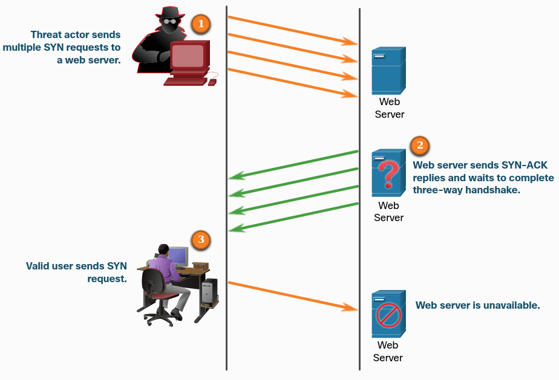
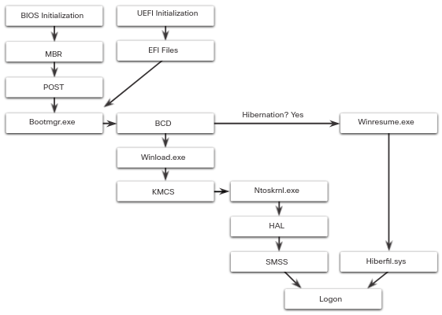
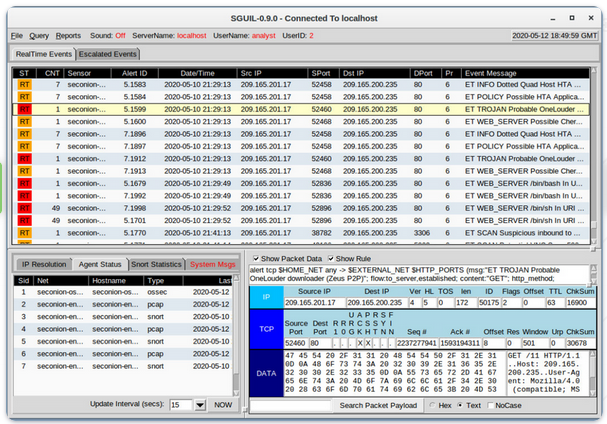

# CISCO Endpoint Security

## "This file should be seen as a simple summary of concepts and useful solutions for the various modules."

Install **Packet Tracer** from [here](https://skillsforall.com/resources/lab-downloads?courseLang=en-US)

Tutorials:

* [Starter](https://skillsforall.com/content/varmir/1.0/m0/course/en-US/assets/1.0.7-packet-tracer---logical-and-physical-mode-exploration.pksz)

## Threats

* **Software attacks**, a successful denial-of-service [DoS attack] or a computer virus

* **Software errors**, bugs, an application going offline or a cross-site script or illegal file server share

* **Sabotage**, an authorized user successfully penetrating and compromising an organization's primary database or the defacement of an organization's website

* **Human error**, inadvertent data entry errors or a firewall misconfiguration

* **Theft**, devices being stolen from an unlocked room

* **Hardware failures**

* **Utility interruption**, electrical power outages or water damage resulting from sprinkler failure

* **Natural disasters**

## Internal Vs External Threats

**Internal threats** are usually carried out by current or former employees and other contract partners.

**External threats** typically stems from amateur or skilled attackers

## User Threats and Vulnerabilities

A **User domain** includes anyone with access to an organization's information system. Users are considered the weakest link in information security systems.

* **No awareness of security**
  
  Users must be aware of and understand an organization's sensitive data, security policies and procedures.

* **Poorly enforced security policies**
  
  Security policies must be known be all the users.

* **Data theft**

* **Unauthorized downloads and media**
  
  Users must not download from the web or from removable devices.

* **Unauthorized virtual private network [VPNs]**
  
  Users must not use VPNs.

* **Unauthorized websites**

* **Destruction of systems, applications or data**
  
  Activists or competitors can delete or destroy data and devices.

---

### Backdoor

Backdoor programs such as Netbus and Back Orifice, are used by cyber criminals to gain unauthorized access to a system by bypassing the normal authentication procedures.

Users inside the organization must run a **remote administrative tool program [RAT]** in order to install the backdoor.

### Rootkit

It modifies the operating system to create a backdoor, which attackers can then use to access the computer remotely.

Using privilege escalation they can modify all kinds of system files and also system forensics and monitoring tools.

---

## Social Engineering

It is a non-technical strategy that attempts to manipulate individuals into performing certain actions or divulging confidential information.

* **Pretexting**, an individual lies to gain access to privileged data.

* **Something for something [quid pro quo]**

* **Identity fraud**

## Social Engineering  Tactics

* **Authority**
  
  When a users is instructed by someone they perceive as an authority figure

* **Intimidation**

* **Consensus / Social proof**
  
  Based on the fact that people tend to act in the same way as other people around them, thinking that something must be right if others are doing it

* **Scarcity**
  
  Based on the fact that people tend to act in a certain way when there is a limited quantity of something available

* **Urgency**

* **Familiarity**
  
  People are more likely to do what another person asks if they like this person

* **Trust**
  
  Building trust in a relationship with a victim may require more time to establish

---

### Shoulder Surfing

It is a simple attack that involves observing or literally looking over a target's shoulder to gain valuable information

### Dumpster Diving

It is the process of going through a target's trash to see what information has been thrown out

### Piggybacking and Tailgating

It occurs when a criminal follows an authorized person to gain physical entry into a secure location

---

### Invoice Scam

Fake invoices are sent with the goal of receiving money from a victim by prompting them to put their credentials into fake login screen

### Watering hole attack

It is an exploit in which an attacker observes or guesses what websites an organization uses most often, and infects one or more of them with malware

### Typosquatting

Incorrect URL can redirect to a legitimate-looking website owned by the attacker

---

# Cyber Attacks

## Viruses

It is a type of computer program that, when executed, replicates and attaches itself to other files, such as legitimate program, by inserting its own code into it.

Once a virus is active, it will usually infect other programs on the computer or other computers on the network.

## Worms

It is a malicious software program that replicates by independently exploiting vulnerabilities in networks. The initial infection of the host, they do not require user participation and can spread very quickly over the network, usually slowing it down.

## Trojan horse

It is a malware that carries out malicious operations by masking its true intent.

## Logic Bombs

It is a malicious program that waits for a trigger, such as a specified date or database entry, to set off the malicious code.

Once activated, a logic bomb implements a malicious code that causes harm to a computer in various ways. It can sabotage database records, erase files and attack operating systems or applications.

They can also attack and destroy hardware components, overdriving components.

## Ramsomware

This malware is designed to hold a computer system or the data it contains captive until a payment is made.

## Denial of Service [DoS] attacks

Those are a type of network attack that is relatively simple to conduct, even for an unskilled attacker. They usually result in some sort of interruption to network services, causing a significant loss of time and money.

* **Overwhelming quantity of traffic**

* **Malicious formatted packets**, the receiver of the packet it's unable to handle it

---

## Domain Name System

These are many essential technical services needed for a network to operate

* **Domain reputation**
  
  **Domain Name System [DNS]** is used by DNS servers to translate a domain name. If a DNS server does not know an IP address, it will ask another DNS server.
  
  An organization needs to monitor its domain reputation, including its IP address, to help protect against malicious external domains

* **DNS spoofing / DNS Cache poisoning**
  
  It is an attack in which false data is introduced into a DNS resolver cache (recent visits to websites of a computer)

* **Domain hijacking**
  
  Happens when an attacker gains control of a target's DNS information, they can make unauthorized changes to it.

* **Uniform resource location [URL]**
  
  It is a simple redirect; an attacker can redirect to malicious pages.

---

## Layer 2 Attacks

Layer 2 refers to the **data link layer** in the Open Systems Interconnection [OSI] data communication model. In this layer data is moved across a linked physical network.

IP addresses are mapped to each physical device address [MAC] on the network, using a procedure called address resolution protocol [ARP].

* **Spoofing / Poisoning**
  
  * **MAC address spoofing** occurs when an attacker disguises their device as a valid one on the network and can therefore bypass the authentication process
  
  * **ARP spoofing** sends spoofed ARP messages across a LAN, in order to link an attacker's MAC address to the IP address of an authorized device on the network
  
  * **IP spoofing** sends IP packets from a spoofed source address in order to disguise it

* **MAC Flooding**
  
  It can compromise a network because an attacker floods the network with fake MAC addresses, compromising the security of the network switch.

---

### Man-in-the-Middle attack [MitM]

It happens when a cybercriminal takes control of a device without the user's knowledge. With this level of access, an attacker can intercept, manipulate and relay false information between the sender and the intended destination.

*Not presented by CISCO: "MitM is really famous during the cryptographic key-exchange, you can google about it"*

### Man-in-the-Mobile attack [MitMo]

It is a type of attack used to take control over a user's mobile device. When infected the mobile device is instructed to exfiltrate user-sensitive information and send it to the attackers.

*ZeuS allow to MitMo specialized in two-step verification SMS messages*

---

# Wireless and Mobile Device Attacks

## Grayware

It is an unwanted application that behaves in an annoying or undesirable manner. And while grayware may not carry any recognizable malware, i may still pose a risk to the user, tracking your location or delivering unwanted advertising.

## SMiShing

Short message service phishing are fake text messages prompt you to visit malicious websites or call a fraudulent phone number.

## Rogue Access Point

It is a wireless access point installed on a secure network without explicit authorization. It represents an opportunity for attackers looking to gain access to an organization's network.

Attackers will often use social engineering tactics to gain physical access to an organization's network infrastructure and install the rogue access point.

The access point can be used as a MitM device to capture your login information:

*"By disconnecting the rouge access point, which trigger the network to send a deauthentication frame to disassociate the access point. This process is then exploited by spoofing your MAC address and sending a deauthentication data transmission to the wireless access point"*

An **Evil twin attack** describes a situation in where the attacker's access point is set up to look a better connection option. So that the attacker can analyze your network traffic and execute MitM attacks.

## Bluejacking

It uses wireless Bluetooth technology to send unauthorized messages or shocking images to another Bluetooth device.

## Bluesnarfing

It occurs when an attacker copies information, such as emails and contact lists, from a target's device using Bluetooth connections.

---

# Application Attacks

## Cross-Site Scripting [XSS]

It is the action of injecting malicious code into a web page; when the web page is accessed by a user, the code is executed and session information and other info can be stolen from the user.

* **Cross-site request forgery [CSRF]** describes the malicious exploit of a website where unauthorized commands are submitted from a user's browser to a trusted web application

## Code Injection

It is based on the **improper input handling attack** because the user input is not properly validated

* **XML injection attack** works by interfering with an application's processing of XML or query entered by a user in order to corrupt data on the XML db and threaten the security of the website

* **SQL injection attack** takes advantage of a vulnerability in which the application does not correctly filter the data entered by a user for character in an SQL statement; useful for gain unauthorized access to information stored on the db

* **DLL injection attack** allows a cybercriminal to trick an application into calling a malicious DLL file, which executes as part of the target process. DLL files are a library that contains a set off code and data for carrying out a particular activity in Windows

* **LDAP injection attack** exploits input validation vulnerabilities by injecting and executing queries to LDAP servers used for authenticating user access to directory services

This type of attack can show up **Error handling attacks** in which useful information can be retrieved from error raised by a malformed input.

## Buffer Overflow

It occurs when data is written beyond the limits of a buffer, in order to make a system crash, compromise data or provide escalation privileges.

* **Race condition attack**, it is not a kind of buffer overflow but it is a functional bug.
  
  Also known as **Toc Tou attack** (Time of Check or Time of Use), happens when a computing system that is designed to handle tasks in a specific sequence is forced to perform two or more operations simultaneously.
  
  *"See process / threads race conditions to understand better"*

## Remote Code Executions

It allows a cybercriminal to take advantage of application vulnerabilities to execute any command with the privileges of the user running the application on the target device; this is propaedeutical for a privilege escalation exploit that using bugs, design flaws or misconfigurations can allow the access to restricted resources.

* `Metasploit Project` is a computer security project that provides information about security vulnerabilities and aids in penetration testing.
  
  Among the tools they have developed is the `Metasploit Framework`, which can be used for developing and executing exploit code against a remote target.
  
  `Meterpreter` in particular is a payload within Metasploit that allows users to take control of a target's device by writing their own extensions and uploading these files into a running process in the device. *"These files are loaded from the memory, they never involve the hard drive, so that cannot be detected by antivirus"*

## Replay Attack

It is a situation where a valid data transmission is maliciously or fraudulently repeated or delayed by an attacker.

*"This is linked with the MitM attack"*

## Directory traversal Attack

It is the ability to read file outside of the directory of the website.

*"Carried out using the URL or load/download inside the website"*

---

# Email / Contact Attacks

## Phishing

It occurs when a user is contacted by email or instant message - or in  any other way - by someone masquerading as a legitimate person or organization.

## Spear phishing

It is a highly targeted attack, that sends customized emails to a specific person based on information the attacker knows about them.

## Vishing

It is a voice phishing.

## Pharming

It misdirects users to a fake version of an official website.

## Whaling

It is a phishing attack that involves high profile individuals.

---

---

# Module 1 Quiz solutions

> What type of attack occurs when data goes beyond the memory areas allocated to an application?
> 
> * Buffer overflow

> Which of the following statements describes a distributed denial of service (DDoS) attack?
> 
> * A botnet of zombies, coordinated by an attacker, overwhelms a server with  DoS attacks

> Employees in an organization report that the network access is slow. Further investigation reveals that one employee downloaded a third-party scanning program for the printer. 
> 
> What type of malware may have been introduced?
> 
> * Worm

> Employees in an organization report that they cannot access the customer database on the main server. Further investigation reveals that the database file is now encrypted. Shortly afterward, the organization receives a threatening email demanding payment for the decryption of the database file.
> 
> What type of attack has the organization experienced?
> 
> * Ransomware

> A penetration test carried out by an organization identified a backdoor on the network. What action should the organization take to find out if their systems have been compromised?
> 
> * Look for unauthorized accounts

> What non-technical method could a cybercriminal use to gather sensitive information from an organization?
> 
> * Social engineering

> A secretary receives a phone call from someone claiming 
> that their manager is about to give an important presentation but the 
> presentation files are corrupted.
> 
> The caller sternly asks that the secretary email the presentation right away to a personal email address. The caller also states that the secretary is being held personally responsible for the success of this presentation. 
> 
> What type of social engineering tactic is the caller using?
> 
> * Intimidation

> All employees in an organization receive an email stating that their account password will expire immediately and that they should reset their password within five minutes.
> 
> Which of the following statements best describes this email?
> 
> * It is a hoax

> Which best practices can help defend against social engineering attacks?
> 
> **Select three correct answers**
> 
> * Educate employees regarding security policies, Resist the urge to click on enticing web links, Do not provide password resets in a chat window

> What do you call an impersonation attack that takes advantage of a trusted relationship between two systems?
> 
> * Spoofing

> A cybercriminal sends a series of maliciously formatted packets to a database server, which causes the server to crash.
> 
> What do you call this type of attack?
> 
> * DoS

> The awareness and identification of vulnerabilities is a critical function of a cybersecurity specialist. Which of the following resources can they use to identify specific details about vulnerabilities?
> 
> * CVE national database

---

---

# Securing Networks

## Vectors of Network Attacks

An attack vector is a path by which a threat actor can gain access to a server, host, or network. Attack vectors originate from inside or outside the corporate network.

* **External threat** = outside the internal network

* **Internal threat** = employee or from internal network

## Data loss

It is likely to be an organization's most valuable asset. Data loss or data exfiltration, is when data is intentionally or unintentionally lost, stolen, or leaked to the outside world. 

**Data loss vectors:**

* **Email / social networking**

* **Unencrypted Devices**

* **Cloud Storage Devices**

* **Removable media**

* **Hard copy**, confidential data should be shredded when no longer required

* **Improper Access control**

Packet Tracer exercise: [here](investigate_threat.pka)

---

## Module "Who is Attacking Our Network"

Empty because it is easy and redundant. I suggest checking for yourself if this is the case for you.

---

---

# Module 2 Quiz solutions

> Which security measure is typically found both inside and outside a data center facility?
> 
> * continuous video surveillance

> What is hyperjacking?
> 
> * taking over a virtual machine hypervisor as part of a data center attack

> Which statement accurately characterizes the evolution of threats to network security?
> 
> * Internal threats can cause even greater damage than external threats.

> When considering network security, what is the most valuable asset of an organization?
> 
> * data

> Which resource is affected due to weak security settings for a device owned by the company, but housed in another location?
> 
> * cloud storage device

> In the video that describes the anatomy of an attack, a threat actor was able to gain access through a network device, download data, and destroy it. Which flaw allowed the threat actor to do this?
> 
> * a flat network with no subnets or VLANs

> Refer to the exhibit. An IT security manager is planning security updates on this particular network. Which type of network is displayed in the exhibit and is being considered for updates?
> 
> * CAN

> What are two security features commonly found in a WAN design? (Choose two.)
> 
> * firewalls protecting the main and remote sites, VPNs used by mobile workers between sites

> Which security technology is commonly used by a teleworker when accessing resources on the main corporate office network?
> 
> * VPN

> Which technology is used to secure, monitor, and manage mobile devices?
> 
> * MDM

---

---

# IP PDU Details

IP was designed as a Layer 3 connectionless protocol. It provides the necessary functions to deliver a packet from a source host to a destination host over an interconnected system of networks. It cannot track or manage the flow of packets, for this purpose TCP of Layer 4 is required.

## IPv4

The **header** is composed of:

* `version` = 4bit value usually = 0100 that identifies IPv4 packet

* `internet header length` = 4bit value up to 20 describes the length of the IP header

* `differentiated services [DS]` = 8bit value determines the priority of the packet
  
  * `differentiated services code point [DSCP]` = 6bit most important
  
  * `explicit congestion notification [ECN]` = 2bit last bits

* `total length` = 16bit = 2byte value of the total length header + user data

* `identification` | `flag` | `fragment offset` used for fragment the packet when a route cannot handle the full size of the packet. The packet will be fragmented into smaller packets and reassembled later.

* `time-to-live [TTL]` = 8bit value that describes the lifetime of the packet. It decreases every time it is processed by a router. If it is == 0 the packet will be discarded and a Internet Control Message Protocol [ICMP] Time Exceeded message will be sent to the sender.

* `protocol` = 8bit that indicates the data payload type that the packet is carrying, which enables the network layer to pass the data to the appropriate upper-layer protocol.

* `header checksum` calculated based on the contents of the IP header to determine if any errors have been introduced during transmission.

* `source IPv4 address` = 32bit it is an unicast IPv4 address

* `destination IPv4 address` = 32bit

* `options` | `padding` used to add a padding to ensure that this field contains a multiple of 32 bits

## IPv6

The **header** is composed of:

* `version` = 4bit value usually = 0110 that identifies IPv6 packet

* `traffic class` = 8bit value is the same of `DS` for IPv4 packets (priority)

* `flow label` = 20bit packets with the same value of flow label must be handled by routers in the same way

* `payload length` = 16bit

* `next header` = 8bit equivalent to the `protocol` for IPv4

* `hop limit` = 8bit equivalent to the `TTL` for IPv4

* `source IPv6 address` = 128bit

* `destination IPv6 address` = 128bit

---

# IP vulnerabilities

## ICMP attacks

**ICMP Internet Control Message Protocol** was developed to carry diagnostic messages and to report error conditions when routes, hosts, and ports are unavailable. ICMP messages are generated by devices when a network error or outage occurs.

Threat actors use Internet Control Message Protocol [ICMP] echo packets (pings) to discover subnets and hosts on a protected network, to generate DoS flood attacks, and to alter host routing tables. [*reconnaissance and scanning attacks*]

### ICMP Flood

* `echo request` and `echo reply` it is used to perform host verification and DoS attacks

* `unreachable` used to perform network reconnaissance and scanning attacks

* `mask reply` used to map an internal IP network

* `redirects` used to lure a target host into sending all traffic through a compromised device and create a MitM attack

* `router discovery` used to inject bogus route entries into the routing table of a target host

Networks should have strict ICMP access control list [ACL] filtering on the network edge to avoid ICMP probing from the internet. Based on captured traffic and log files we can detect attack attempts.

### Amplification and Reflection attacks

1. **Amplification** - The threat actor forwards ICMP `echo` request message to many hosts. These messages contain the source IP address of the victim.

2. **Reflection** - These hosts all reply to the spoofed IP address of the victim to overwhelm it.

## Denial-of-Service [DoS] attacks

## Distributed Denial-of-Service [DDoS] attacks

## Address Spoofing attacks

Threat actors spoof the source IP address in an attempt to perform blind spoofing or non-blind spoofing. IP address spoofing attacks occur when a threat actor creates packets with false source IP address information to either hide the identity of the sender, or to pose as another legitimate user.

* **Non-Blind spoofing** 
  
  The threat actor can see the traffic that is being sent between the host and the target. It uses the "non-blind spoofing" to inspect the `reply` packets from the victim. Helps determining the state of a firewall and the sequence number prediction. Can also hijack an authorized session.

* **Blind spoofing**
  
  THe threat actor cannot see the traffic that is being sent between the host and the target. It is used in DoS attacks.

A threat actor can also spoof the MAC address. When a malicious user has access to the internal network, it can change its MAC address in order to be recognized as a different device.

The switch of the violated network changes the CAM table entry and assigns the MAC address to the new port.

## Man-in-the-Middle [MitM]

Threat actors position themselves between a source and destination to transparently monitor, capture, and control the communication. They could simply eavesdrop by inspecting captured packets or alter packets and forward them to their original destination.

## Session hijacking

Threat actors gain access to the physical network, and then use an MitM attack to hijack a session.

---

---

# TCP

It provides these services:

* **Reliable delivery**
  
  TCP incorporates acknowledgments to guarantee delivery, instead of relying on upper-layer protocols to detect and restore errors. If a timely acknowledgment is not received, the sender retransmits the data. Requiring acknowledgments of received data can cause substantial delays.

* **Flow control**
  
  TCP implements flow control to address this issue. Rather than acknowledge one segment at a time, multiple segments can be acknowledged with a single acknowledgment segment.

* **Stateful communication**
  
  TCP stateful communication between two parties occurs during the TCP three-way handshake.

# TCP attacks

## TCP SYN Flood attack

The attacker continually sending TCP SYN session request packets with a random spoofed source IP address to the target. The target replies with a TCP SYN-ACK packet to the spoofed IP address and waits for a TCP ACK packet.

The TCP ACK packet will never arrive to the victim in this way TCP services are denied to legitimate users.

## TCP Reset attack

A TCP connection terminates when it receives a `RST` bit. So a malicious user can send a spoofed packet containing a TCP `RST` packet to one or both endpoints.

## TCP Session Hijacking

The threat actor must spoof the IP address of one host, predict the next sequence number, and send an ACK to the other host. If successful, the threat actor could send, but not receive, data from the target device.

---

# UDP

It is used for real-time applications such as media streaming or VoIP. It is connectionless transport layer protocol.

# UDP Attacks

UDP is not protected by any encryption. You can implement one or add a checksum, but in both cases it is not difficult to change it.

## UDP Flood attacks

All the resources on the network are consumed. The threat actor must use a tool like UDP Unicorn or Low Orbit Ion Cannon. These tools send a flood of UDP packets, often from a spoofed host, to a server on the subnet. This results in a DoS attack.

---

---

# Module 3 Quiz solutions

> Which field in an IPv6 packet is used by the router to determine if a packet has expired and should be dropped?
> 
> * Hop limit

> An attacker is using a laptop as a rogue access point to capture all network traffic from a targeted user. Which type of attack is this?
> 
> * 

> Which field in the IPv4 header is used to prevent a packet from traversing a network endlessly?
> 
> * Time-to-Live

> What is involved in an IP address spoofing attack?
> 
> * A legitimate network IP address is hijacked by a rogue node.

> Which type of attack involves the unauthorized discovery and mapping of network systems and services?
> 
> * reconnaissance

> In which TCP attack is the cybercriminal attempting to overwhelm a target host with half-open TCP connections?
> 
> * SYN flood attack

> How is optional network layer information carried by IPv6 packets?
> 
> * inside an extension header attached to the main IPv6 packet header

> A threat actor wants to interrupt a normal TCP communication between two hosts by sending a spoofed packet to both endpoints. Which TCP option bit would the threat actor set in the spoofed packet?
> 
> * RST

> A threat actor uses a program to launch an attack by sending a flood of UDP packets to a server on the network. The program sweeps through all of the known ports trying to find closed ports. It causes the server to reply with an ICMP port unreachable message and is similar to a DoS attack. Which two programs could be used by the threat actor to launch the attack? (Choose two.)
> 
> * UDP Unicorn, Low Orbit Ion Cannon

> Which term describes a field in the IPv4 packet header used to detect corruption in the IPv4 header?
> 
> * header checksum

> What kind of ICMP message can be used by threat actors to map an internal IP network?
> 
> * ICMP mask reply

> Users in a company have complained about network performance. After investigation, the IT staff has determined that an attacker has used a specific technique that affects the TCP three-way handshake. What is the name of this type of network attack?
> 
> * SYN flood

---

---

# IP Services

## ARP

Hosts broadcast an ARP request to other hosts on the network segment to determine the MAC address of a host with a particular IP address. All hosts on the subnet receive and process the ARP request. The host with matching IP address in the `ARP request` sends an `ARP reply`.

Any host can send a `gratuitous ARP` so that he says "I'm the owner of IP / MAC" this can be used for malicious purposes.

## ARP Cache poisoning

It can be used to launch various Man-in-the-Middle attacks.

1. `ARP request`, a device requires the MAC address of its default gateway; therefore, it sends an ARP request for a MAC address

2. `ARP reply`, the device updates its ARP cache with the IP and MAC addresses of a device. The device sends a ARP reply to the requesting device.

3. `Spoofed Gratuitous ARP replies`, the threat actor sends two spoofed `gratuitous ARP` replies using its own MAC address for the other destination IP addresses. Now the threat actor is the new default gateway of the device that updates its ARP cache. This is a **MitM attack**.
   
   * **Passive ARP poisoning**
     
     When the threat actor steal confidential information
   
   * **Active ARP poisoning**
     
     When the threat actor modifies data in transit or inject malicious data

---

## DNS

The Domain Name Service protocol defines an automated service that matches resource names, such as www.xyz.com, with the required numeric network address (IPv4 or IPv6). It includes the format for queries, responses, and data and uses resource records [RR] to identify the type of DNS response.

## DNS Open Resolver attacks

A DNS open resolver answers queries from clients outside of its administrative domain.

* **DNS cache poisoning attacks**
  
  The threat actor sends spoofed, falsified record resource [RR] information to a DNS resolver to redirect users from legitimate sites to malicious sites. DNS cache poisoning attacks can all be used to inform the DNS resolver to use a malicious name server that is providing RR information for malicious activities

* **DNS amplification and reflection attacks**
  
  Threat actors send DNS messages to the open resolvers using the IP address of a target host. The server will always reply, so a Dos or DDoS can be carried out in order to hide the true source of an attack

* **Fast flux**
  
  The DNS IP addresses are continuously changed within minutes so that it is possible to hide phishing and malware delivery sites and botnets

* **Double IP flux**
  
  Threat actors change the hostname to IP address mappings and also change the authoritative name server; it can be used in combination with Fast flux

* **Domain generation algorithms**
  
  Used to randomly generate domain names that can then be used as rendezvous point to their command ans control CoC servers

* **DNS Domain shadowing attacks**
  
  The threat actor must gather domain account credentials in order to silently create multiple sub-domains to be used during the attacks. These subdomains typically point to malicious servers without alerting the actual owner of the parent domain

## DNS Tunnelling

The DNS is used from threat actors for botnets that are user to spread malware or launch DDoS attacks and phishing attacks.

Threat actors who use DNS tunnelling place non-DNS traffic within DNS traffic. This method often circumvents security solutions. For the threat actor to use DNS tunnelling, the different types of DNS records such as `TXT`, `MX`, `SRV`, `NULL`, `A` or `CNAME` are altered.

A TXT record can store the commands that are sent to the infected host bots as DNS replies. DNS tunnelling attack using TXT works like this:

1. The data is split into multiple encoded chunks

2. Each chunk is placed into a lower level domain name label of the DNS query

3. Because there is no response from the local or networked DNS for the query, the request is sent to the ISP's recursive DNS servers

4. Recursive DNS service will forward the query to the attacker's authoritative name server

5. The process is repeated until all of the queries containing the chunks are sent

6. When the attacker's authoritative name server receives the DNS queries from the infected device, it sends responses for each DNS query, which contains the encapsulated, encoded commands

7. Malware on the compromised host recombines the chunks and executes the commands hidden within

---

## DHCP

DHCP servers dynamically provide IP configuration information to clients.

1. A client broadcasts a `DHCP discover` message

2. The DHCP server responds with an unicast offer that includes addressing information the client can use; `DHCP offer`

3. The client broadcasts a `DHCP request` to tell the server that the client accepts the offer

4. The server replies with a unicast acknowledgment accepting the request; `DHCP ack`

## DHCP Spoofing attacks

It occurs when a rogue DHCP server is connected to the network and provides false IP configuration parameters to legitimate clients.

A rogue server can provide a variety of misleading information:

* **wrong default gateway**
  
  The threat actor provide an invalid gateway or the IP address of its host to create a MitM attack

* **wrong DNS server**
  
  Threat actor provides an incorrect DNS server address pointing the user to a malicious website

* **wrong IP address**
  
  Threat actor provides an invalid IP address, invalid default gateway IP address, or both. The threat actor then creates a DoS attack on the DHCP client

---

# Enterprise Services

## Common HTTP exploits

* **Malicious iFrames**

* **HTTP 302 Cushioning**
  
  The threat actors use the `302 Found` HTTP response status code to direct the user's web browser to a new location.

* **Domain Shadowing**
  
  The threat actor must first compromise a domain. Then, the threat actor must create multiple subdomains of that domain to be used for the attacks.

## Email

* **Attachment-base attacks**

* **Email spoofing**
  
  Threat actors create email messages with a forged sender address that is meant to fool the recipient into providing money or sensitive information.

* **Spam email**

* **Open mail relay server**
  
  Threat actors take advantage if enterprise servers that are misconfigured as open mail relays to send large volumes of spam or malware to unsuspecting users.

* **Homoglyphs**

---

---

## Defending the network

* Develop a write security policy for the company

* Educate employees

* Control physical access to systems

* Use strong passwords and change them

* Encrypt and password-protect sensitive data

* Implement security HR and SW such as firewalls, intrusion prevention/detection systems, virtual private network devices, antivirus and content filtering

* Perform backups and test them

* Shut down unnecessary services and ports

* Keep patches up-to-date

* Perform security audits

## Mitigating / Countering Malware

One way for mitigating virus and trojan horse attacks is antivirus software. Antiviruses must be up-to-date. We must remember that antiviruses don't prevent viruses from entering the network!

Security devices at the network perimeter can identify known malware files based on their indicators of compromise in order to prevent malware files from entering the network.

## Mitigating / Countering Worms

Worms are more network-based than viruses.

1. **Containment**
   
   This phase involves limiting the spread of a worm infection to areas of the network that are already affected. This requires *compartmentalization* and *segmentation* of the network to slow down or stop the worm and to prevent currently infected hosts from targeting and infecting other systems.
   
   `outgoing ACL` and `incoming ACL` on routers and firewalls

2. **Inoculation**
   
   This phase runs parallel or subsequent to the containment phase. All uninfected systems are patched with the appropriate vendor patch. The aim of this phase is to deprive the worm of any available target

3. **Quarantine**
   
   During this phase we must track down and identify the infected machines within the contained areas and disconnecting, blocking, or removing them.

4. **Treatment**
   
   This phase involves actively disinfecting infected systems. This can involve terminating the worm process, removing modified files or systems settings that the worm introduced, and patching the vulnerability the worm used to exploit the system.

## Mitigating Reconnaissance attacks

We can setup alarms triggered when a certain parameters are exceeded, such as the number of ICMP requests per second.

* Implementing authentication to ensure proper access

* Using encryption to render packet sniffer attacks useless

* Using anti-sniffer tools to detect packet sniffer attacks

* Implementing a switched infrastructure

* Using a firewall and IPS

## Mitigating Access attacks

* Strong passwords

* Disable accounts after specified number of unsuccessful logins has occurred

* Use Encryption

* Principle of Minimum Trust

* Multi factor Authentication

* Create and Read log files

Access attacks can be detected by reviewing logs, bandwidth utilization, and process loads.

## Mitigating DoS attacks

One of the first signs of a DoS attack is a large number of user complaints about unavailable resources or unusually slow network performance

* Network behavior analysis can detect unusual patterns of usage

* Network utilization graph

* Network utilization software

---

---

# Module 4 Quiz solutions

> Which action best describes a MAC address spoofing attack?
> 
> * altering the MAC address of an attacking host to match that of a legitimate host

> What is an objective of a DHCP spoofing attack?
> 
> * to provide false DNS server addresses to DHCP clients so that visits to a legitimate web server are directed to a fake server

> What is the primary means for mitigating virus and Trojan horse attacks?
> 
> * antivirus software

> What method can be used to mitigate ping sweeps?
> 
> * blocking ICMP echo and echo-replies at the network edge

> What worm mitigation phase involves actively disinfecting infected systems?
> 
> * treatment

> What is the result of a DHCP starvation attack?
> 
> * Legitimate clients are unable to lease IP addresses.

> Which term is used for bulk advertising emails flooded to as many end users as possible?
> 
> * Spam

> Which type of DNS attack involves the cybercriminal compromising a parent domain and creating multiple subdomains to be used during the attacks?
> 
> * shadowing

> Which protocol would be the target of a cushioning attack?
> 
> * HTTP

> Which language is used to query a relational database?
> 
> * SQL

> Which two attacks target web servers through exploiting possible vulnerabilities of input functions used by an application? (Choose two.)
> 
> * cross-site scripting, SQL injection

> In which type of attack is falsified information used to redirect users to malicious Internet sites?
> 
> * DNS cache poisoning

> What is a characteristic of a DNS amplification and reflection attack?
> 
> * Threat actors use DNS open resolvers to increase the volume of attacks and to hide the true source of an attack.

---

---

# Wireless Communications

## 802.11 Frame

Recall that all Layer 2 consist of a header, payload, and **Frame Check Sequence** [FCS] section.

* **Frame Control** = Type of wireless frame, protocol version, frame type, address type, power management, and security settings

* **Duration** = Remaining duration needed to receive the next frame transmission

* **Address1** = MAC address of the receiving device

* **Address2** = MAC address of the transmitting device

* **Address3** = MAC address of the destination, such as the router interface

* **Sequence Control** = Control sequencing and Fragmented frames

* **Address4** = For AdHoc mode

## Carrier Sense Multiple Access Collision Avoidance [CSMA / CA]

WLANs are half-duplex, shared media configurations. Half-duplex means that only one client can transmit or receive at any given moment. Shared media means that wireless clients can all transmit and receive on the same radio channel.

So wireless client cannot hear while it is sending, which makes it impossible to detect a collision.

The solution is using CMSA/CA on WLANs:

1. Client listens on the channel to see if it is idle, which means that it senses no other traffic on the channel / carrier

2. Sends a `ready to send [RTS]` message to the AP to request dedicated access to the network

3. Receives a `clear to send [CTS]` message from the AP granting access to send

4. If the wireless client does not receive a CTS message, it waits a random amount of time before restarting the process

5. After it receives the CTS, it transmits the data

6. All transmissions are acknowledged. If a client does not receive an ack, it assumes a collision occurred

## Wireless Client and AP association

For wireless devices to communicate over a network, they must first associate with an AP or wireless route. Wireless device must:

1. Discover a wireless AP

2. Authenticate with AP

3. Associate with AP

They must agree on specific parameters:

* **SSID** = SSID name appears in the list of available wireless networks on a client

* **Password** = required from the wireless client to authenticate

* **Network mode** = refers to the 802.11a/b/g/n/ac/ad WLAN standards. APs and routers can support clients connecting via multiple standards

* **Security mode** = WEB, WPA or WPA2

* **Channel settings** = frequency bands used to transmit data

Wireless devices must discover and connect to an AP or wireless router.

* **Passive Discover mode**
  
  The AP openly advertises its service by periodically sending broadcast beacon frames containing the SSID, supported standards, and security settings

* **Active Discover mode**
  
  Wireless clients must know the name of the SSID. The wireless client initiates the process by broadcasting a probe request frame on multiple channels. The probe request includes the SSID name and standards supported

## Wireless Security

A WLAN is open to anyone within range of an AP and the appropriate credentials to associate to it. Attacks can be generated by outsiders, disgruntled employees, and even unintentionally by employees.

Wireless network are specifically susceptible to several threats, including:

* **Interception of data**

* **Wireless intruders**

## DoS attacks

Wireless DoS attacks can be the result of:

+ **Improperly configured devices**
  
  Configuration errors can disable the WLAN

+ **A malicious user intentionally interfering with the wireless communication**
  
  Their goal is to disable the wireless network completely or to the point where no legitimate device can access the medium

+ **Accidental interference**
  
  The 2.4 GHz band is more prone to interference than the 5 GHz band

## Rogue Access points

Anyone with access to the premises can install an inexpensive wireless router that can potentially allow access to secure network resource. Once connected, the rogue AP can be used by the attacker to capture MAC address, capture data packets, gain access to network resources, or launch a MitM attack.

A personal network hotspot could also be used as a rogue AP.

## Man-in-the-Middle attack

A popular wireless MitM attack is called the **evil twin AP** attack, where an attacker introduces a rogue AP and configures it with the same SSID as a legitimate AP. The malicious AP will send the traffic (from and to the victim) to the legit AP.

---

# Secure WLAN

## SSID Cloaking

APs and some wireless routers allow the SSID beacon frame to be disabled, wireless clients must manually configure the SSID to connect to the network.

## MAC Address Filtering

An administrator can manually permit or deny clients wireless access based on their physical MAC hardware address.

## 802.11 Original Authentication Methods

MAC addresses can be spoofed and SSID can be easily discovered. The best way to secure a wireless network is to use authentication and encryption systems

* **Open system authentication**
  
  It is used only in situations where security is of no concern. The wireless client is responsible for providing security such as using VPNS

* **Shared Key authentication**
  
  Provides mechanisms, such as WEP, WPA, WPA2, and WPA3 to authenticate and encrypt data between a wireless client and AP
  
  * **Personal**. intended for home or small office networks, users authenticate using a pre-shared key [PSK]
  
  * **Enterprise**, It requires a Remote Authentication Dial-In User Service [RADIUS] authentication server. The device must be authenticated by the RADIUS server and then users must authenticate using 802.1x standards

## Encryption Methods

The WPA and WPA2 standards use the following encryption protocols:

* **Temporal Key integrity protocol [TKIP]** used by WPA. It provides support for legacy WLAN equipment by addressing the original flaws associated with the 802.11 WEP encryption method.
  
  It makes use of WEP, but encrypts the Layer 2 payload using TKIP, and carries out a *Message Integrity Check [MIC]* in the encrypted packet to ensure the message has not been altered.

* **Advanced Encryption Standards [AES]** used by WPA2. It uses the *Counter Cipher Mode* with *Block Chaining Message Authentication Code protocol [CCMP]* that allows destination hosts to recognize if the encrypted and non-encrypted bit have been altered.

Packet Tracer exercise: [here](wireless_security.pka) and [here](analyze_wireless.pksz)

## WPA3

* **Personal**
  
  Threat actors can listen to "handshakes" between a wireless client and the AP and use brute force attack to try to guess the PSK

* **Enterprise**
  
  It uses 802.1X/EAP authentication. But it requires the use of a 192bit cryptographic suite and eliminates the mixing of security protocols for previous 802.11 standards

* **Open networks**
  
  It does not require authentication but they do use Opportunistic Wireless Encryption [OWE] to encrypt all wireless traffic

---

---

# Module 5 Quiz solutions

> City Center Hospital provides WLAN connectivity to its employees. The security policy requires that communication between employee mobile devices and the access points must be encrypted. What is the purpose of this requirement?
> 
> * to prevent the contents of intercepted messages from being read

> What is a feature that can be used by an administrator to prevent unauthorized users from connecting to a wireless access point?
> 
> * MAC filtering

> What is an advantage of SSID cloaking?
> 
> * Clients will have to manually identify the SSID to connect to the network.

> For which discovery mode will an AP generate the most traffic on a WLAN?
> 
> * passive mode

> At a local college, students are allowed to connect to the wireless network without using a password. Which mode is the access point using?
> 
> * open

> An employee connects wirelessly to the company network using a cell phone. The employee then configures the cell phone to act as a wireless access point that will allow new employees to connect to the company network. Which type of security threat best describes this situation?
> 
> * rogue access point

> The company handbook states that employees cannot have microwave ovens in their offices. Instead, all employees must use the microwave ovens located in the employee cafeteria. What wireless security risk is the company trying to avoid?
> 
> * accidental interference

> Which two roles are typically performed by a wireless router that is used in a home or small business? (Choose two.)
> 
> * access point, Ethernet switch

> What method of wireless authentication is dependent on a RADIUS authentication server?
> 
> * WPA2 Enterprise

> Which wireless encryption method is the most secure?
> 
> * WPA2 with AES

> Which parameter is commonly used to identify a wireless network name when a home wireless AP is being configured?
> 
> * SSID

> Which wireless parameter refers to the frequency bands used to transmit data to a wireless access point?
> 
> * channel setting

> Which device can control and manage a large number of corporate APs?
> 
> * WLC

> A wireless engineer is comparing the deployment of a network using WPA2 versus WPA3 authentication. How is WPA3 authentication more secure when deployed in an open WLAN network in a newly built company-owned cafe shop?
> 
> * WPA3 uses OWE to encrypt all wireless traffic

---

---

# Security Devices

## Firewalls

Firewalls are resistant to network attacks, are the only transit point between internal corporate networks and external networks ans enforce the access control policy.

| Benefits                                                                                               | Limitations                                                                               |
| ------------------------------------------------------------------------------------------------------ | ----------------------------------------------------------------------------------------- |
| Prevent the exposure of sensitive hosts, resources and applications                                    | Misconfigured firewall can have serious consequences (single point of failure)            |
| Sanitize protocol flow                                                                                 | The data from many applications cannot be passed over firewalls securely                  |
| Block malicious data                                                                                   | Users might search for ways around the firewall to receive blocked material               |
| Reduce security management complexity (network access control managed by few firewalls in the network) | Network performance can slow down                                                         |
|                                                                                                        | Unauthorized traffic can be tunneled or hidden as legitimate traffic through the firewall |

Firewall design is primarily about device interfaces permitting or denying traffic based on the source, the destination, and the type of traffic.

## Firewall Designs

* **Private and Public**
  
  The public network (outside network) is untrusted, and the private network (inside network) is trusted
  
  * Traffic originating from the private network is permitted and inspected as it travels toward the public network. Inspected traffic returning from the public network and associated with traffic that originated from the private network is permitted
  
  or
  
  * Traffic originating from the public network and traveling to the private network is generally blocked

* **Demilitarized Zone [DMZ]**
  
  It is a design where there is **one inside interface** connected to the private network, **one outside interface** connected to the public network and **one DMZ interface**
  
  
  
  * Traffic originating from the public network
    
    * Traveling to the private network = blocked
    
    * Traveling toward the DMZ = selectively permitted and inspected
  
  * Traffic from the DMZ
    
    * Traveling to the public network = dynamically permitted
    
    * Traveling to the private network = blocked
  
  * Traffic from the private network
    
    * Traveling to the public network or DMZ = inspected and permitted with little or no restriction

* **Zone-Based policy firewalls**
  
  A zone is a group of one or more interfaces that have similar functions or features. Traffic between interfaces in the same zone is not subject to any policy and passes freely. All zone-to-zone traffic is blocked (a policy allowing or inspecting traffic must be configured)

## Firewall Types

### Packet Filtering (Stateless) firewall

This is usually part of a router firewall, which permits or denies traffic based on Layer 3 and Layer 4 information. It uses a simple policy table lookup that filters traffic based on specific criteria **ACLs**.

### Stateful firewall

It is the most versatile and most common firewall, it provides stateful packet filtering by using connection information maintained in a stable table.

### Application Gateway firewall / Proxy firewall

It filters information at Layer 3, 4, 5, and 7 of the OS reference model. Most of the firewall control and filtering is done in software. When a client needs to access a remote server, it connects to a proxy server. The proxy server connects to the remote server on behalf of the client.

### Host-based (server and personal) firewall

A PC or server with firewall software running on it.

### Transparent firewall

Filters IP traffic between a pair of bridged interfaces.

### Hybrid firewall

A combination of various firewall types.

---

# Intrusion Prevention and Detection Devices

When implementing **Intrusion Detection Systems [IDS]** or **Intrusion Prevention Systems [IPS]** it is important to be familiar with the types of systems available, host-based and network-based approaches, the placement of these systems and the role of signature categories.

1. Malicious traffic is sent to the target host that is inside the network

2. The traffic is routed into the network and received by an IPS-enabled sensor where it is blocked

3. The IPS-enabled sensor sends logging information regarding the traffic to the network security management console

4. The IPS-enabled sensor kill all the traffic (sent to the Bit Bucket)

Those are sensors that can be in the form of several different devices:

* router configured with CISCO IOS IPS software

* device specifically designed to provide dedicated IDS or IPS services

* network module installed in an adaptive security appliance [ASA], switch or router

IDS and IPS use **signature** to detect patterns in network traffic. Can detect **atomic signature patterns [single packet]** or **composite signature patterns [multi-packet]**.

| Solution | Advantages                                                                                                                                                             | Disadvantages                                                                                                                               |
| -------- | ---------------------------------------------------------------------------------------------------------------------------------------------------------------------- | ------------------------------------------------------------------------------------------------------------------------------------------- |
| **IDS**  | No impact on network latency and jitter; No network impact if there is a sensor failure; No network impact if there is sensor overload; It is deployed in OFFLINE mode | Response action stops trigger packets; Correct tuning required for response actions; More vulnerable to network security evasion techniques |
| **IPS**  | Stops trigger packets; Can use stream normalization techniques                                                                                                         | Sensor issues might affect network traffic; Sensor overloading impacts the network; Some impact on network latency and jitter               |

## Types of IPS

### Host-based IPS [HIPS]

It is a  software installed on a host to monitor and analyze suspicious activity. It can protect operating system and critical system processes that are specific to that host. It can prevent the host from executing commands that do not match typical behavior (unauthorized registry updates, and activities that cause buffer overflows). It can also monitor network traffic to prevent the host from participating in DoS attack or being part of an illicit FTP session.

It is like a firewall + antivirus sw + antimalware sw.

The problem is that it only works on a **local level**.

### Network-based IPS

Sensors detect malicious and unauthorized activity in real time and can take action when required. This allow security managers to monitor network activity while it is occurring, regardless of the location of the attack target.

---

## Specialized Security Appliances

* **CISCO Advanced Malware Protection [AMP]**
  
  It provides comprehensive malware protection for organization before, during, and after an attack:
  
  * [Before], AMP strengthens defenses and protects against known and emerging threats
  
  * [During], AMP identifies and blocks policy-violating file types, exploit attempts, and malicious files from infiltrating the network
  
  * [After], AMP goes beyond point-in-time detection capabilities and continuously monitors and analyzes all file activity and traffic

* **CISCO Web Security Appliance [WSA]**
  
  It is a secure web gateway that combines leading protections to help organizations address the growing challenges of securing and controlling web traffic.It blocks risky sites and tests unknown sites before allowing the users to access them.

* **CISCO Email Security Appliance [ESA]**

---

# Security Services

## Traffic control with ACLs

An Access Control List is a series of command that control whether a device forwards or drops packets based on information found in the packet header.

* They limit network traffic to increase network performance

* They provide traffic flow control

* They provide a basic level of security for network access

* They filter traffic based on traffic type

* They screens hosts, to permit or deny access to network services

They can also select types of traffic to be analyzed, forwarded, or processed in other ways.

ACLs filter IPv4 packets based on several attributes:

* `protocol type`

* `source IPv4 address`

* `destination IPv4 address`

* `source TCP or UDP ports`

* `destination TCP or UDP ports`

* `optional protocol type information`

Packet Tracer exercise: [here](acl.pka)

---

## Simple Network Management Protocol [SNMP]

It allows administrators to manage end devices such as servers, workstations, routers, switches, and security appliances, on an IP network.

It is an application layer protocol that provides a message format for communication between:

* SNMP manager that runs SNMP management sw

* SNMP agents which are the nodes being monitored and managed

---

## NetFlow

It is a tools that provides statistics on packets flowing through a CISCO router or multilayer switch. A packet can be considered of a different flow based on:

* `source IP addr`

* `destination IP addr`

* `source port number`

* `destination port number`

* `Layer 3 protocol type` = type of header

* `Type of Service [ToS] marking` = how to apply quality of service to the packets

* `input logical interface`

---

## Port Mirroring

It is a feature that allows a switch to make **duplicate copies of traffic** passing through a switch, and then send it out to a port with a network monitor attached.

---

## Syslog Servers

Many networking devices support syslog, including routers, switches, application servers, firewalls, and other network appliances. The syslog protocol allows networking devices to send their system messages across the network to syslog servers. These messages can be either non-critical or significant.

Syslog logging service provide:

* the ability to gather logging information for monitoring and troubleshooting

* the ability to select the type of logging information that is captured

* the ability to specify the destination of captured syslog messages

---

## Network Time Protocol [NTP]

This protocol allows routers on the to synchronize their time settings with an NTP server. A group of NTP clients that obtain time and date information from a single source have more consistent time settings. When NTP is implemented in the network, it can be set up to synchronize to a private primary clock or it can synchronize to a publicly available NTP server on the internet.

NTP networks use a hierarchical system of time sources. Each level in this hierarchical system is called a **stratum**. The stratum level is defined as the number of hop counts from the authoritative source.

NTP servers are arranged in three levels known as strata:

* **Stratum 0** = Authoritative time servers
  
  High-precision timekeeping devices assumed to be accurate and with little or no delay associated with them

* **Stratum 1** = devices directly connected to the authoritative time sources
  
  They act as the primary network time standard

* **Stratum 2 and lower strata** = NTP clients
  
  They use NTP packets to synchronize their time from stratum 1 servers, they could also act as servers from stratum 3 devices

---

## AAA Servers

Are servers that respect **Authentication** (centralized control access to the network), **Authorization** (which resources can an authenticated user access) and **Accounting** (records what the user does).

**Terminal Access Controller Access-Control System Plus [TACACS+]** and RADIUS are both authentication protocols that are used to communicate with AAA servers.

|                 | TACACS+                                                                                     | RADIUS                                                                                     |
| --------------- | ------------------------------------------------------------------------------------------- | ------------------------------------------------------------------------------------------ |
| Transport       | TCP                                                                                         | UDP                                                                                        |
| Protocol CHAP   | Bidirectional challenge and response as used in Challenge Handshake Authentication Protocol | Unidirectional challenge and response from the RADIUS security server to the RADIUS client |
| Confidentiality | Entire packet encrypted                                                                     | Password encrypted                                                                         |

---

## Virtual Private Network [VPN]

A VPN is a communications environment in which access is strictly controlled to permit peer connections within a defined community of interest. Confidentiality is achieved by encrypting the traffic within the VPN. *"See tunneling to better understand how it works"*

---

---

# Module 6 Quiz solutions

> What is the purpose of a personal firewall on a computer?
> 
> * to filter the traffic that is moving in and out of the PC

> What is the main difference between the implementation of IDS and IPS devices?
> 
> * An IDS would allow malicious traffic to pass before it is addressed, whereas an IPS stops it immediately.

> Which protocol provides authentication, integrity, and confidentiality services and is a type of VPN?
> 
> * IPsec

> What is a feature of the TACACS+ protocol?
> 
> * It encrypts the entire body of the packet for more secure communications.

> Which firewall feature is used to ensure that packets coming into a network are legitimate responses to requests initiated from internal hosts?
> 
> * stateful packet inspection

> Refer to the exhibit. The network "A" contains multiple corporate servers that are accessed by hosts from the Internet for information about the corporation. What term is used to describe the network marked as "A"?
> 
> * DMZ

> Which statement describes the Cisco Cloud Web Security?
> 
> * It is a cloud-based security service to scan traffic for malware and policy enforcement.

> Which two statements are true about NTP servers in an enterprise network? (Choose two.)
> 
> * NTP servers ensure an accurate time stamp on logging and debugging information., NTP servers at stratum 1 are directly connected to an authoritative time source.

> How is a source IP address used in a standard ACL?
> 
> * It is the criterion that is used to filter traffic.

> Which network service allows administrators to monitor and manage network devices?
> 
> * SNMP

> What is a function of a proxy firewall?
> 
> * connects to remote servers on behalf of clients

> What network monitoring technology enables a switch to copy and forward traffic sent and received on multiple interfaces out another interface toward a network analysis device?
> 
> * port mirroring

---

---

# Windows Operating System

A **hardware abstraction layer [HAL]** is software that handles all of the communication between the hardware and the kernel. The kernel is the core of the operating system and has control over the entire computer. It handles all of the input and output requests, memory, and all of the peripherals connected to the computer.

The upper part of the image describes the *user mode*.

Installed applications run in user mode, and operating system code runs in kernel mode. Code executing in kernel mode has unrestricted access to the underlying hardware and is capable of executing CPU instruction. 

When user mode code runs, it is granted its own restricted address space by the kernel.

The bottom part of the image describes the *kernel mode*.

All of the code that runs in kernel mode uses the same address space. Kernel-mode drivers have no isolation from the operating system. If an error occurs with the driver running in kernel mode, and it writes to the wrong address space, the operating system or another kernel-mode driver could be adversely affected.

## File System

* **exFAT**
  
  FAT has limitations to the number of partitions, partition size, and file sizes that can address, so it is not usually used for hard drivers [HDs] or solid-state drivers [SSDs] anymore. Both FAT16 and FAT32 are available to use, with FAT32 being the most common because it has many fewer restrictions that FAT16

* **Hierarchical File System Plus [HTF+]**
  
  This is the file system used on MAC OS X computers and allows much longer filenames, file sizes, and partitions sizes than previous file systems. It is not supported by Windows, but it is still able to read from them.

* **Extended File System [EXT]**
  
  File system used on Linux-based computers. Windows can still read from them.

* **New Technology File System [NTFS]**
  
  It is the most used, all versions of Linux and Windows support this. Mac-OS X can read from them and can also write on them using special drivers.
  
  It supports very large files and partitions and it is very compatible with other operating systems. It is very reliable and supports recovery features. It also supports many security features, data access control is achieved through security descriptors. **Security descriptors** contain file ownership and permissions all the way down to the file level. It also tracks many time stamps to track file activity (**timestamps Modify, Access, Create, and Entry Modified [MACE]**).
  
  A hard drive must be formatted with a file system, it is divided in partitions. Each partition in a logical storage unit that can be formatted to store information, such as data files or applications.
  
  NTFS formatting creates :
  
  * `partition boot sector` - first 16 sectors of the drive, that contains the location of the Master File Table [MFT]; the last 16 sectors contain a copy of the boot sector
  
  * `master file table [MFT]` - table that contains the locations of all the files and directories on the partition, including file attributes such as security information and timestamps
  
  * `system files` - hidden files that store information about other volumes and file attributes
  
  * `file area` - main area of the partition where files and directories are stored
  
  We can also connect to NTFS an **Alternate Data Stream [ADSs]** to the files that can store additional information about the file. Example: file.txt:ADS using `more file.txt:ADS` we can read the additional information.
  
  *"ADS can be used to store malicious code!"*

## Windows Boot Process

Two types of computer firmware exist:

* **Basic Input-Output System [BIOS]**
  
  The process begins with the BIOS initialization phase. This is when hardware devices are initialized and power on self-test [POST] is performed to make sure all of these devices are communicating. When the file system is discovered, the POST ends (after looking for the master boot record [MBR]).
  
  The **master boot record [MBR]** contains a small program that is responsible for locating and loading the OS.

* **Unified Extensible Firmware Interface [UEFI]**
  
  The UEFI firmware has a lot of visibility into the boot process, UEFI boots by loading EFI program files, stored as `.efi` files in a special disk partition, known as the EFI System partition [ESP]. Boot code is stored in the firmware in order to increase the security.

After a valid Windows installation is located, the **Bootmgr.exe** is run. This file switches the system from real mode to protected mode so that all of the system memory can be used. This file reads the **Boot Configuration Database [BCD]** that contains any additional code needed to start the computer, along with an indicator of whether the computer is coming out of hibernation, or it is a cold start.

* From hibernation it will run `Winresume.exe` that reads the `Hiberfil.sys` which contains the state of the computer when it was put into hibernation

* From cold start it will run the `Winload.exe` that creates a record of the hardware configuration in the registry. The registry is a record of all of the setting, options, hardware, and software the computer has. Winload.exe also uses kernel mode Code Signing [KMCS] to make sure that all drivers are digitally signed. After all of that it runs `Ntoskrnl.exe` which starts Windows kernel and sets up the HAL, the Session Manager Subsystem [SMSS] reads the registry create the user environment, start the Winlogon service, and prepare each user's desktop as they log on.

## Windows startup

There are two important registry items that are used to automatically start applications and services:

* `HKEY_LOCAL_MACHINE` many information, including services that start with each boot

* `HKEY_CURRENT_USER` information about the logged user, including services that start only when the user logs on the computer

We can change all of the start-up options for the computer, using `Msconfig.exe`

## Windows shutdown

The computer will close user mode applications first, followed by kernel mode processes. User mode applications can be forced but kernel mode processes can block the shutdown process (hanging the process) and it must be turn off using the power button.

## Processes, Threads, and Services

One application can have one or many processes dedicated to it. Each process that runs is made up of at least one thread.

All the threads dedicated to a process are contained within the same address space.

Some of the processes that Windows runs are services. These are programs that run in the background to support the operating system and applications. Services provide long-running functionality.

## Memory Allocation and Handles

Instructions are stored in RAM until the CPU processes them. The virtual address space for a process is the set of virtual addresses that the process can use. The virtual address is an entry in a page table that is used to translate the virtual address into the physical address.

* 32-bit Windows computer have a virtual address space up to 4 gigabytes

* 64-bit Windows computer have a virtual address space up to 8 terabytes

When the user space process needs to access kernel resources, it must use a process handle.

## Windows Registry

Windows stores all of the information about hw, applications, users, and system settings in a large database known as the registry. The registry is a hierarchical database where:

* Hive
  
  * Keys
    
    * SubKeys
      
      * Values = `REG_BINARY` numbers and boolean values | `REG_DWORD` numbers > 32 bit and raw data| `REG_SZ` strings

Windows have many hives, here are presented the most important:

* `HKEY_CURRENT_USER [HKCU]`

* `HKEY_USERS [HKU]`, information about all the users on the host

* `HKEY_CLASSES_ROOT [HKCR]`, information about object linking and embedding [OLE] registrations, that allow users to embed objects from other applications into a single document

* `HKEY_LOCAL_MACHINE [HKLM]`

* `HKEY_CURRENT_CONFIG [HKCC]`, information about the current hardware profile

New hives cannot be created. Registry keys and values can be created, modified, or deleted by a user with administrative privileges. Using `regedit.exe` we can change values and keys.

---

## Windows Management Instrumentation

It is used to manage remote computers. It can retrieve information about computer components, hw and sw statistics, and monitor the health of remote computers.

Some attacks today use WMI to connect to remote systems, modify the registry, and run commands. WMI helps them to avoid detection because it is common traffic, most often trusted by the network security devices and the remote WMI commands do not usually leave evidence on the remote host.

---

## The net command

`net` command is used in the administration and maintenance of the OS, it supports many subcommands:

* `net accounts` sets passwords and logon requirements for users

* `net session` lists of disconnects sessions between a computer and other computers on the network

* `net share` creates, removes or manages shared resources

* `net start` starts a network service or lists running network services

* `net stop` stops a network service

* `net use` connects, disconnects, and displays information about shared network resources

* `net view` shows a list of computers and network devices on the network

----

## The nslookup and netstat command

Domain Name System [DNS] should also be tested because it is essential to finding the address of hosts by translating it from a name, such as a URL.

`nslookup <URL>` allows to test DNS, when the address is returned, you know that DNS is functioning correctly.

`netstat` allows to see details of active network connections, also check what ports are open and where they are connected and their status. It is useful to see inbound and outbound TCP connections so that we can discover unauthorized connections.

We can link connections with running processes using: `netstat -abno`

---

# Windows Security

## Event Viewer

It logs the history of application, security, and system events. These log files are a valuable troubleshooting tool because they provide information necessary to identify a problem.

Categories of event log:

* **Windows logs**

* **Application and Service logs**

## Local Security Policy

A security policy is a set of objectives that ensures the security of a network, the data, and the computer systems in an organization. The security policy is a constantly evolving document based on changes in technology, business, and employee requirements.

* **Domain security policies** apply to all computers that join the domain

* **Account policies** are automatically set when a user logs in to a computer that is a member of a domain
  
  * Password policies and Account Lookout policy that prevents brute-force login attempts.

## Windows Defender

It is the built-in virus and spyware protection.

It can acts as:

* Antivirus that continuously monitors for viruses; when a virus is detected, the user is warned, and the program attempts to quarantine or delete virus

* Adware protection

* Phishing protection blocks the IP addresses of known phishing websites and warns the user about suspicious sites

* Spyware protection scans for keyloggers and other spyware

* Trusted / Untrusted sources warns you about unsafe programs installed or unsafe websites

## Windows Defender Firewall

Allows to selectively deny traffic to a computer or network segment. 

*"Test it to better understand"*

---

---

# Module 7 Quiz solutions

> When a user makes changes to the settings of a Windows system, where are these changes stored?
> 
> * Registry

> For security reasons a network administrator needs to ensure that local computers cannot ping each other. Which settings can accomplish this task?
> 
> * firewall settings

> Which user account should be used only to perform system management and not as the account for regular use?
> 
> * administrator

> What technology was created to replace the BIOS program on modern personal computer motherboards?
> 
> * UEFI

> What term is used to describe a logical drive that can be formatted to store data?
> 
> * Partition

> What utility is used to show the system resources consumed by each user?
> 
> * Task Manager

> Which command is used to manually query a DNS server to resolve a specific host name?
> 
> * nslookup

> Which **net** command is used on a Windows PC to establish a connection to a shared directory on a remote server?
> 
> * net use

> What would be displayed if the **netstat -abno** command was entered on a Windows PC?
> 
> * all active TCP and UDP connections, their current state, and their associated process ID (PID)

> What is the purpose of the **cd∖** command?
> 
> * changes directory to the root directory

> Which Windows version was the first to introduce a 64-bit Windows operating system?
> 
> * Windows XP

> How much RAM is addressable by a 32-bit version of Windows?
> 
> * 4 GB

> A security incident has been filed and an employee believes that someone has been on the computer since the employee left last night. The employee states that the computer was turned off before the employee left for the evening. The computer is running slowly and applications are acting strangely. Which Microsoft Windows tool would be used by the security analyst to determine if and when someone logged on to the computer after working hours?
> 
> * Event Viewer

---

---

# Linux Operating System

It is often the operating system of choice in the **Security Operations Center [SOC]** because it is *open source*, *powerful*, and *allows a better network communication control and better control over the OS*.

The figure shows `Sguil`, which is the cybersecurity analyst console in a special version of Linux called Security Onion.

*"This figure is an example of one common SOC tool"* other tools can be:

* **Network packet capture software**
  
  Useful to observe and understand every detail of a network transaction `Wireshark`

* **Malware analysis tool**
  
  Safely run and observe malware execution without risk of compromising the underlying system

* **Intrusion Detection System [IDSs]**
  
  Real-time traffic monitoring and inspection, if any aspect of currently flowing traffic matches any of the established rules, a pre-defined action is taken

* **Firewalls**
  
  Specify, based on pre-defined rules, whether traffic is allowed to enter or leave a network device

* **Log managers**
  
  Record events using log files and allow an easy monitoring

* **Security information and event management [SIEM]**
  
  Real-time analysis of alerts and log entries generated by network appliances such as IDSs and firewalls

* **Ticketing System**
  
  Task ticket assignment, editing, and recording. Security alerts are often assigned to analysts through a ticketing system

## Linux Servers and Clients

Servers provide services to clients across the network. Each service require a separate server software. A computer can be the server for multiple services, ports are used for this purpose. A port is a reserved network resource used by a service. A server is *listening* on a port when it has associated itself to that port.

Well-known ports:

| Port      | Description                                    |
| --------- | ---------------------------------------------- |
| `20/21`   | File Transfer Protocol [**FTP**]               |
| `22`      | Secure Shell [**SSH**]                         |
| `23`      | **Telnet** remote login service                |
| `25`      | Simple Mail Transfer Protocol [**SMTP**]       |
| `53`      | Domain Name System [**DNS**]                   |
| `67/68`   | Dynamic Host Configuration Protocol [**DHCP**] |
| `69`      | Trivial File Transfer Protocol [**TFTP**]      |
| `80`      | Hypertext Transfer Protocol [**HTTP**]         |
| `110`     | Post Office Protocol version 3 [**POP3**]      |
| `123`     | Network Time Protocol [**NTP**]                |
| `143`     | Internet Message Access Protocol [**IMAP**]    |
| `161/162` | Simple Network Management Protocol [**SNMP**]  |
| `443`     | HTTP Secure [**HTTPS**]                        |

The famous `nmap` is used to scan a network for open ports.

## Service Configuration Files

In Linux services are managed using configuration files. Common options are port number, location of the hosted resources, and client authorization details.

When the service starts, it looks for its configuration files, load them into memory, and adjusts itself according to the settings in the files.

## Monitoring Service Logs

In Linux, log files can be categorized as:

* Application logs

* Event logs

* Service logs

* System logs

Popular log files and their function:

| Linux Log File                     | Description                                                                                                                               |
| ---------------------------------- | ----------------------------------------------------------------------------------------------------------------------------------------- |
| `/var/log/messages`                | Used to store informational and non-critical system messages                                                                              |
| `/var/log/auth.log`                | Stores all authentication-related events, anything involving the user authorization mechanism                                             |
| `/var/log/secure`                  | Used in redHat and CentOS computers instead of /var/log/auth.log; it also tracks sudo logins, SSH logins, and other errors logged by SSSD |
| `/var/log/boot.log`                | Stores boot-related information and messages logged during the computer startup process                                                   |
| `/var/log/dmesg`                   | Contains kernel ring buffer messages, info about hw devices and their drivers                                                             |
| `/var/log/kern.log`                | Contains information  logged by the kernel                                                                                                |
| `/var/log/cron`                    | Contains execution status and error messages created by a scheduled task using **Cron**                                                   |
| `/var/log/mysqld.log or mysql.log` | All debug, failure and success messages related to the mysql process and mysql_safe deamon are logged                                     |

## Linux File System

* **ext2**
  
  Also called the *Second extended file system* was the default file system for Linux; It is the file system of choice for flash-based storage media because it does not use a journal (+ performance -number of writes).

* **ext3**
  
  Also called the *Third extended file system* is a journaled file system designed to improve the existing ex2 file system; A **journal** is a technique used to minimize risk of file system corruption in the event of sudden power loss (log of all the file system changes).

* **ext4**

* **Network File System [NFS]**
  
  It is a network-based file system, allowing file access over the network.

* **Compact Disc File System [CDFS]**
  
  Created for optical disk media.

* **Swap File System**
  
  It is used by Linux when it runs out of RAM, when this happens, the kernel moves inactive RAM content to the swap partition on the disk.

* **Hierarchical File System Plus [HFS+]**
  
  Used by Apple; Linux kernel includes a module for mounting HFS+ for read-write operations.

* **Apple File System [APFS]**
  
  It provides strong encryption and is optimized for flash and solid-state drives.

* **Master Boot Record [MBR]**
  
  located in the first sector of a partitioned computer, the MBR stores all the info about the way in which the file system is organized.

*Mounting* is the term used for the process of assigning a directory to a partition. After a successful mount operation, the file system contained on the partition is accessible through the specified directory.

Windows uses *drive letters*

Linux uses *directory = mount point*

*"Using `mount` command you can see how the list of file system currently mounted in a Linux computer"*

## Linux Roles and File Permission

In Linux most system entities are treated as files. File permissions are built into the file system structure and provide mechanism to define permissions on every file. Permissions define the actions that the owner, the group, and others can perform with the file. The command `ls -l` lists all the files in the `cwd` with their permissions.

The permissions are `read [r], write [w] and execute [x]`.

Considering the output of `ls -l space.txt`:

`-rwxrw-r-- 1 analyst staff 253 May 20 12:46 space.txt`

1. **permissions**
   
   * The first `-` means that this is a file, for directories `d`
   
   * The first 3 characters are the user permissions (analyst) 
   
   * The second 3 characters is for the group permissions (staff)
   
   * The third 3 characters is for the other group or user on the computer

2. **number of hard links**
   
   * The `1` after the file permissions
   
   * An hard link creates another file with a different name linked to the same place in the file system [**inode**]

3. **file size**
   
   * The `253` after the group field, described in bytes

We can change permissions using `chmod` using octal values:

| Binary | Octal | Permissions | Description             |
| ------ | ----- | ----------- | ----------------------- |
| 000    | 0     | ---         | No access               |
| 001    | 1     | --x         | Execute only            |
| 010    | 2     | -w-         | Write only              |
| 011    | 3     | -wx         | Write and Execute       |
| 100    | 4     | r--         | Read only               |
| 101    | 5     | r-x         | Read and Execute        |
| 110    | 6     | rw-         | Read and Write          |
| 111    | 7     | rwx         | Read, Write and Execute |

## Hard links and Symbolic links

Use `ln` to create an **hard link** (another file that points to the same location as the original file). `ls <srcfile> <destfile>`. If you change a file, the other is changed as well.

* If the source file is deleted the hard link works fine

* Hard links are limited to the file system

* Hard links cannot link to directories

A **symbolic link** is created using `ln -s <srcfile> <destfile>` it is also called soft link, it is similar to the hard link, if you change a file the other is changed as well.

* If the source file is deleted the symbolic link does not work

* Symbolic links can link to file on another file system

* Symbolic links can link to directories

## Working on Linux Host

Linux includes programs called package managers, to install a package, all the necessary files are placed in the correct file system location.

* Arch Linux uses `pacman`

* Debian and Ubuntu Linux uses `apt` for `dpkg` (debian packages)

Using `apt-get`:

* `update` gets the package list from the package repository and update the local package database

* `upgrade` updates all currently installed packages to their latest version

Using `apt`:

* `install <dpkgname>`

* `remove <dpkgname>`

## Processes and Forks

**Process** is a running instance of a computer program.

**Forking** is a method that the kernel uses to allow a process to create a copy of itself. Processes need a way to create new processes in multitasking operating systems; the fork operation is the only way of doing so in Linux.

When a process calls a fork, the caller process becomes the *parent* process, with the newly created process referred to as its child. Forked processes have different process IDs [PIDs] but run the same program code.

* **Scalability**, an example is for Apache web server, forking itself it can serve a large number of requests whit fewer system resources than a single-process-based server.

Useful commands for process managing:

| Command | Description                                                                                                    |
| ------- | -------------------------------------------------------------------------------------------------------------- |
| `ps`    | Lists the processes running on the computer; you can filter by user/groups                                     |
| `top`   | Lists the processes running on the computer *dynamically*                                                      |
| `kill`  | Removes, restarts, or pauses a process, it needs the PID of a process and most of the time you need to be root |

## Rootkit Check

A rootkit is a type of malware that is designed to increase an unauthorized user's privileges or grant access to portions of the software that should not normally be allowed. Also used to secure a backdoor to a compromised computer.

Rootkit removal can be complicated and often impossible, especially in cases where the rootkit resides in the kernel; **re-installation** of the OS is usually the only real solution. **Firmware rootkits usually require hw replacement!**

`chrootkit` is program designed to check the computer for known rootkits; it is a shell script that uses common Linux tools such as *strings* and *grep* to compare the **signature of core programs**.

`lynis` is program that checks configuration files in order to see if there can be any security improvement.

---

---

# Module 8 Quiz solutions

> An author is uploading one chapter document from a personal computer to a file server of a book publisher. What role is the personal computer assuming in this network model?
> 
> * client

> In the context of a Linux operating system, which command can be used to
>  display the syntax and parameters for a specific command?
> 
> * man

> A system administrator issues the command **ps** on a server that is running the Linux operating system. What is the purpose of this command?
> 
> * to list the processes currently running in the system

> A system administrator issues the **apt-get upgrade** command on a Linux operating system. What is the purpose of this command?
> 
> * Every application installed will update itself to the latest version.

> Why would a rootkit be used by a hacker?
> 
> * to gain access to a device without being detected

> Consider the result of the **ls -l** command in the Linux output below. What are the group file permissions assigned to the analyst.txt file?
> 
> `ls –l analyst.txt  
>    -rwxrw-r-- sales staff 1028 May 28 15:50 analyst.txt`
> 
> * read, write

> Which type of tool is used by a Linux administrator to attack a computer or network to find vulnerabilities?
> 
> * PenTesting

> What is a benefit of Linux being an open source operating system?
> 
> * Linux distribution source code can be modified and then recompiled.

> Which method can be used to harden a device?
> 
> * Force periodic password changes.

> Which Linux command can be used to display the name of the current working directory?
> 
> * pwd

> Which file system is the primary file system used by Apple in current Macintosh computers?
> 
> * APFS

> A technician has captured packets on a network that has been running slowly when accessing the internet. Which port number should the technician look for within the captured material to locate HTTP packets?
> 
> * 80

> Which operating system source code can be downloaded and modified by any person or company?
> 
> * Linux

> What is a daemon?
> 
> * a background process that runs without the need for user interaction

---

---

# Defending Systems and Devices

## Operating system security

To harden an operating system an organization needs:

* A good administrator that can easily configure the Os to protect against outside threats; removing unnecessary programs and services, and making sure that security patches and updates are installed in a timely manner to correct faults and mitigate risks

* A systematic approach in place for addressing system updates; an organization should:
  
  * establish procedures for monitoring security-related information
  
  * evaluate updates for applicability
  
  * plan the installation of application updates and patches
  
  * install updates using a documented plan

* A baseline useful to compare how a system is performing against baseline expectations.
  
  *"Consider the example of `chrootkit` and `lynis`"*

* Install Phishing protection, Adware protection, Trusted/Untrusted sources verification, Antivirus protection, and Spyware protection
  
  *"This is optional"*

## Patch Management

Patches are code updates that prevent a new virus, worm, or other malware from making a successful attack. Patches and upgrades are often combined into a service pack. Windows routinely check for updates.

Cybersecuirty professional must test the patch before deploying it throughout the organization. A **patch management tool** can be used to manage patches locally instead of using the vendor's online update service, useful for:

* Administrators can approve or decline updates

* Administrators can force the update of systems on a specific date

* Administrators can obtain reports on the updates needed by each system

* There is no need for each computer to connect to the vendor's service to download patches; instead, it gets the verified update from a local server

* Users cannot disable or circumvent updates

It is also important to update third-party applications such as Adobe Acrobat, Java and Chrome to address vulnerabilities that could be exploited.

## Endpoint Security
