# Network defense Essentials (NDE)

### Information assurance (IA) Principles

**Confidentiality**, **Integrity** and **Availability**.

**Non-repudiation**: A party in a communication cannot deny sending a message.

**Authentication**: The identity of an individual is verified by the service / system.

---

### Administrative security controls

**Regulatory framework compliance**: security controls to manage sensitive data.

**Security policies**: all the internal "laws" that help preventing security errors.

**Employee monitoring and supervising**: monitor access and uses.

**Information classification**: different roles, different information.

**Security awareness and training**: no training = no security.

---

## PROTOCOLS

### RADIUS

Is an **authentication protocol** which provides centralized *authentication*, *authorization* and *accounting* for remote access to communicate with central server.

**Steps:**

1. A client initiates a connection by sending the *access-request packet* to the server

2. The server receives the access request from the client and compares the credentials with ones stored in the db.
   
   - [SUCCESS] server sends *access-accept message* with an *access-challenge*
   
   - [FAIL] server sends *accept-reject*

3. Client sends the *accounting-request* to the server to specify the accounting information for a connection that was accepted.

4. Server sends *accounting-response message* which states the successful establishment of the network.

### TACACS+  (Terminal access controller access control system)

Is a **network security protocol** used for *AAA* of the **network devices**, TACACS+ **encrypts** the entire communication between client and server in order to protect from *sniffing attacks*.

**Steps:**

1. The already authenticated client requests for a resource directly to the TACACS+ server.

2. The server receives the *REQUEST* and prepares the **service shell**

3. *RESPONSE* is sent to the client including *pass* of *fail*

4. The client will be *granted* or *denied*

### KERBEROS

Is an **authenticating method** for accessing the network.

**Steps:**

1. A users sends its credentials to an **authentication server (AS)**

2. The **AS** *hashes* the password of the user and verifies the credentials in the active directory db.
   
   * [SUCCESS] The **AS** consisting of the **ticket granting service (TGS)** *sends back* the TGS *session key* and the **ticket granting ticket (TGT)** to the user, in order to create a *session*

3. Once the user is authenticated, it sends the *TGT* to request a server ticket to the server or *TGS* for accessing the services

4. The *TGS* authenticates the *TGT* and grants a ***service ticket*** to the user, consisting of the **ticket and a session key**

5. The client send the *service ticket* to the server

6. The server uses its key to *decrypt* the information from the *TGS* and the client is authenticated to the server

### PGP (Pretty good privacy)

Is an **application layer protocol** which provides **cryptographic privacy** and authentication for network communications.

It *encrypts* and *decrypts* email communications as well as authenticates messages with **digital signatures** and *encrypts* stored files.

### S/MIME (Secure/Multipurpose internet mail extensions)

Is an application layer protocol which is used for *sending* **digitally signed** and **encrypted email messages**.

It uses **RSA** system to email encryption and network defenders needs to enable S/MIME-based security for mailboxes in their organization.encrypted email messages

### S-HTTP [deprecated]

Is an application layer protocol that is used to **encrypt web communications** carried over HTTP.  

Problem is that we have some not encrypted communications.

### HTTP (Hypertext transfer protocol secure)

Ensures **secure communication** between two computers over HTTP. The connection is *encrypted* using a **transport layer security (TLS)** or rarely **SSL**. Protects against *man-in-the-middle attack* because of the encrypted channel.

### TLS (Transport layer security)

Ensures a *secure communication* between client-server applications, it prevents the network communication from being eavesdropped or tamped.

* **TLS Record Protocol** ensures *connection security* with encryption

* **TLS Handshake Protocol** ensures client and server *authentication*

### SSL (Secure socket layer)

*Manages the security* of a message transmission on the internet, it uses **RSA asymmetric (public key) encryption** to encrypt data transferred over *SSL* connections.

### IPsec (Internet protocol security)

Is a **network layer protocol** that ensures a secure IP level communication. It provides *end-to-end security* at the internet layer of the internet protocol suite.

It **encrypts** and **authenticates** each IP packet communication.

Supports *network-level peer authentication*, data origin authentication, data integrity, data confidentiality (encryption) and *replay protection*.

---

---

## Access Control

The *Access control* is the selective restriction of access to an asset or a system/network resource. It protects the information assets by determining who can access what.

**Components:**

* **subject**, a particular *user* or *process* that access a resource

* **object**, a *specific resource*

* **reference monitor**, *checks* the **access control rule** for specific restrictions

* **operation**, represents an *action* taken by a subject on an object

---

## Principles:

### Separation of Duties [SoD]

The authorization process is divided in steps, different privileges are assigned at each step to the individual subjects requesting for a resource.

Ensures that no single individual has the authorization rights to perform all functions and simultaneously denies access of all the objects to a single individual.

### Need-to-know

Access is provided only to the information that is required for performing a specific task.

### Principle of Least Privilege [POLP]

Extends the *need-to-know* principle providing only needed rights for each user.

---

## Access Control Models

Are the standards which provide a predefined framework for implementing the necessary level of access control.

### Mandatory Access Control [MAC]

Only the **Admin/Sys owner** has the rights to *assign privileges*, the end user cannot decide who can access the information.

### Discretionary Access Control [DAC]

End user has complete access to the information they **own**

### Role-based Access Control [RBAC]

Permission are assigned based on **user roles**

### Rule-based Access Control [RB-RBAC]

**Permissions are assigned to a user role** dynamically based on a set of rules defined by the administrator

---

### Logical implementation

Is performed using **access control lists (ACLs)**, **group policies**, passwords and account restrictions.

---

## Identity and Access Management [IAM]

Is responsible for providing the **right individual with right access at the right time**

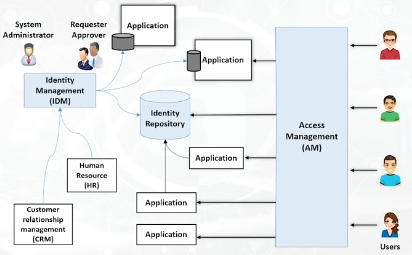

* **Identity Management [IDM]**
  
  User identification involves a method to ensure that *individual holds a valid identity*. Identity management involves **storing** user attributes in their **repositories**.

* **Identity Repositories**
  
  The user repository is a db where attributes related to users' identities are stored.

---

## Authorization systems

### Centralized

It maintains a **single db**  for authorizing all the network resources or applications.

### Decentralized

Each network resource maintains its **authorization unit** and performs authorization locally. It maintains its own **db**

### Implicit

Users can access the required resource **on behalf** of others. The access request goes through a primary resource to access the requested resource.

### Explicit

Requires **separate authorization** for each requested resource, it maintains authorization for each *requested* object.

---

---

## Administrator controls

### Regulatory frameworks compliance

It is often required for the organization to comply with some type of *security regulation*, it is a collaborative effort between governments and privates.

IT security regulatory frameworks contain a set of **guidelines** and **best practices**.

**Why organizations need compliance?**

* **improves security**
  
  IT security *regulation* and *standards* improve overall security by meeting regulatory requirements

* **Minimize losses**
  
  Improved security, in turn, *prevents* security breaches

* **Maintain trust**
  
  Customer trusts the organization in belief that their information is *safe*

---

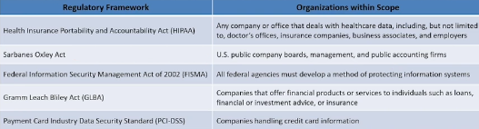

Based on those regulatory requirements (interpreted from the regulatory framework), an organization needs to establish *policies*, *procedures* and *security controls* to manage and maintain compliance.

---

## Payment Card Industry Data Security standard [PCI-DSS]

Is a proprietary **information security standard for organizations** that handle cardholder information. **PCI-DSS** applies to *all entities involved in payment card processing*.

* **Build and Maintain a Secure Network**

* **Maintain a Vulnerability Management Program**

* **Regulatory Monitor and test networks**

* **Protect Cardholder Data**

* **Implement Strong Access Control Measures**

* **Maintain an information Security Policy**

## Health Insurance Portability and Accountability Act [HIPAA]

* **Electronic transaction and code set standards**
  
  Every provider must use *the same health care transactions, code sets and identifiers*

* **Privacy rule**
  
  *Federal protections for the personal health information*

* **Security role**
  
  Safeguards to ensure the *confidentiality, integrity and availability of electronically protected health information*

* **National identifier requirements**
  
  Every employee must have *national numbers that identify them attached to standard transactions*

* **Enforcement rule**
  
  Standards for enforcing all the *Administration Simplification Rules*

---

## [!!!] SARBANES OXLEY ACT [SOX]

It is designed to **protect investors and the public** by increasing the accuracy and reliability of the corporate disclosure

* **TITLE 1**
  
  **Public Company Accounting oversight board [PCAOB]** provides independent oversight of public accounting firms providing *audit services* **(auditors)**

* **TITLE 2**
  
  **Auditor independence**

* **TITLE 3**
  
  **Corporate responsibility** mandates that every senior executives take individual responsibility for the accuracy and completeness of corporate financial reports

* **TITLE 4**
  
  **Enhanced financial disclosures** describe enhanced reporting requirements for financial transactions, including off-balance-sheet transactions ...

* **TITLE 5**
  
  **Analyst conflicts of interest**, more confidence in the reporting of securities analysts

* **TITLE 6**
  
  **Commission resources and authority**

* **TITLE 7**
  
  **Studies and Reports**, credit rating agencies ...

* **TITLE 8**
  
  **Corporate and Criminal fraud accountability**, description of specific criminal penalties for fraud ...

* **TITLE 9**
  
  **Corporate tax return**

* **TITLE 10**
  
  **White collar crime penalty enhancement**

* **TITLE 11**
  
  **Corporate fraud accountability**

* **... 10 titles left ...**

---

## GRAMM-LEACH-BLILEY ACT [GLBA]

It has the objective to ease the transfer of *financial information* between institutions and banks

---

## GENERAL DATA PROTECTION REGULATION [GDPR]

It is used against those who violates its privacy and security standards

---

## DATA PROTECTION ACT [DPA]

It is an act to make provision for the regulation of the processing of information relating to *individuals*.

Individuals have the right:

* data submitted must be processed lawfullly

* get information about how the data are processed

* give the holder of that office responsibilities

---

## Information Security Standards [ISO]

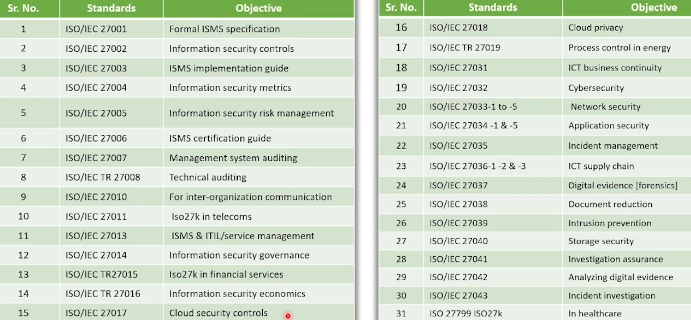

---

## Digital Millennium Copyright Act [DMCA]

It defines the *legal prohibitions* against the circumvention of technological protection measures employed by copyright owners to protect their works

---

## Federal Information Security Management Act [FISMA]

It provides a comprehensive framework for ensuring the *effectiveness of information security controls* over information resources that supports Federal operations and assets

* **standards for categorizing information**

* **standards for minimum security requirements**

* **guidance for selecting appropriate security controls**

* **guidance for assessing security controls**

* **guidance for security authorization of information systems**

---

---

# Security Policy

It is a **well documented set of plans, processes, procedures, standards and guidelines** to establish an ideal information security status of an organization.

Security policies are used to inform people on how to work in a safe and secure manner.

* **Enhanced Data and Network security**

* **Risk mitigation**

* **Better network performance**

* **Quick Response to issues**

* **Monitored and Controlled device usage and data transfers**

## Contents of security policy

### High-level security requirements

The requirements of a system when implementing security policies that include discipline security, safeguard security, procedural security and assurance security

### Policy description based on requirements

### Security concept of operation

Defines the **roles**, **responsibilities** and **functions** of a security policy

### Allocation of security enforcement

Provides a computer system **architecture allocation** to each system in the program

## Types of Information Security Policies

### Enterprise information security policies [EISP]

It drives an organization's scope and provides direction to their security policies

* Application policy

* Network and network devices security policies

* Back up and restore policy

* System security policy

### Issue specific security policies [ISSP]

It directs the audience on the usage of technology-based systems with the help of *guidelines*

* Remote access and wireless policies

* Incident response plan

* Password policies

* Policies for personal devices

### System specific security policies [SSSP]

It directs users while *configuring or maintaining* a system

* DMZ policy

* Encryption policy

* Policies for intrusion detection and prevention

* Access control policy

# Internet Access Policies

## Promiscuous Policy

No restrictions on internet/remote access **(NOTHING IS BLOCKED)**

## Permissive Policy

Known dangerous services/attacks blocked **(KNOWN THREATS BLOCKED)**

## Paranoid Policy

Everything is blocked, no internet connection or severely limited internet usage **(EVERYTHING IS BLOCKED)**

## Prudent Policy

Provides maximum security while allowing known, but necessary, dangers. All services are blocked, except for the *safe or necessary* ones **(EVERYTHING BLOCKED EXCEPT FOR)**

---

## Password Policy

It provides guidelines for using strong passwords for an organization's resources

1. Password length and formation

2. Complexity of password

3. Password blacklists

4. Password duration

5. Common password practice

---

---

# Physical controls

A successful unauthorized physical access may lead to *theft*, *damage* or *modification* of the information system. Physical security is the basis of any *information system program*   in an organization. It allows to restrict unauthorized physical access to the organization or directly to the network.

### Common attack vectors

* **Natural/Environmental Threats**

* **Man-made Threats**

## Types of physical security controls

### Preventive controls

Prevent *security violation* and enforce various access control mechanisms.

[door locks, security guards ...]

### Detective controls

Detect security violations and *record any intrusion attempts*.

[motion detectors, cameras, sensors ...]

### Deterrent controls

Used to discourage attackers and *send warning messages* to the attackers to discourage intrusion attempts.

[warning signs, ... "I will add also in-software detection routines" ...]

### Recovery controls

Used to recover from security violations and *restore information and systems* to a persistent state.

[disaster recovery, backups ...]

### Compensating controls

Used as an alternative control when the *intended controls failed* or *cannot be used*.

[hot sites, backup power systems ...]

---

## Location considerations

* **Visibility of the assets**
  
  *"No servers must be visible from outside"*

* **Neighboring buildings**
  
  *"Better not to have bad actors nearby"*

* **Local considerations**

* **Impact of catastrophic events**
  
  *"Don't stay on active volcano"*

* **Joint tenancy risks**
  
  *"In the 3° floor there is a strange organization; What kind of customers they bring in?"*

---

## Site architecture considerations

You need to consider what kind of rooms do you need in order to keep data and services up and secure, but also people must be secure.

[emergency exits, separate locations for critical systems, plans for environment hazards, sanitation systems ...]

---

## Physical Security policy

Allows to *define guidelines* to ensure that adequate physical security measures are in place. Can be everything relate with physical part of an organization, for example the lighting system.

In the context of environmental threats, we can also think about **heat** and **electromagnetic interference**, which are two of the most important things to consider for proper infrastructure defense.

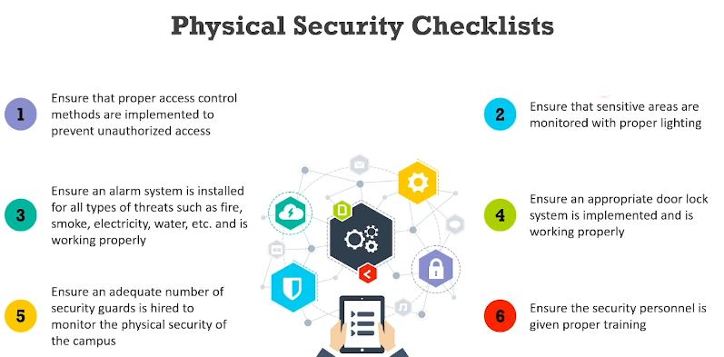

---

---

# Network segmentation

it is the practice of **splitting** a network in smaller network segments and separating groups of systems or applications from each other.

Groups of systems or applications that have no interaction with each other will be placed in different network segments.

**+** Improved security

**+** Better access control

**+** Improved monitoring

**+** better containment

*It is the inverse of a Flat network (no segmentation)*

## Physical segmentation

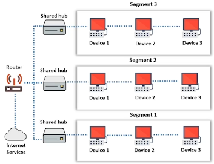

Splitting a large network into smaller physical components, each segment can communicate via *intermediary devices* such as switches, hubs or routers.

It is expensive, it requires a good configuration (each segment requires components and dedicated router network interfaces)

## Logical segmentation

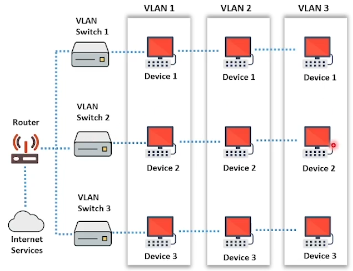

Based on **VLANs**, which are *isolated logically* without considering the physical locations of devices. Each VLAN is an independent logical unit and devices of the VLAN communicate as though they are in their own isolated network.

Firewalls are shared and switches handle the VLAN infrastructure.

It is flexible to implement and to operate.

## Network virtualization

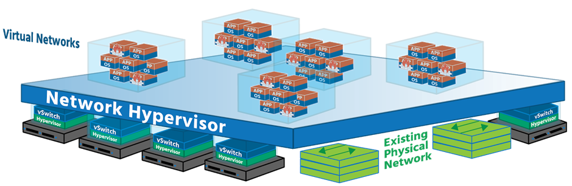

It is a process of *combining* all the available network resources and enabling security professionals to share these resources among the network users using a **single administrative unit**. 

Network virtualization enables each user to access available network resources from their system.

# Firewalls

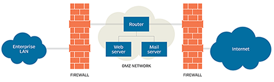

A **Bastion host** is a computer system designed and configured to *protect network resources* from attacks; it is the only host computer on the internet that can be **addressed directly from the public network**.

It provides a limited range of services such as website hosting and mail to ensure security. 

*The bastion host has one interface for the internet and one for the network, basically we can think Windows Defender as a bastion host*

The Bastion must:

+ Minimize the chances of penetration by intruders

+ Create **logs** in order to identify attack or attempts of attack

+ In case of attack, bastion host must act as **scapegoat**

+ Provide an additional level of security

### Positioning of the Bastion Host

* **Physical location**
  
  Must be placed in a specially selected server room with *suitable environmental controls*, in a locked server cabinet with proper ventilation, cooling and backup power.

* **Network location**
  
  Set on a special network also known as **Demilitarized Zone [DMZ]** that **does not carry sensitive data**. Cannot be placed on internal networks, should be located on an addition layer know as **perimeter network**.
  
  *We can attach a* `packet filtering routing` *in order to track packets*

## DMZ Network

It is a computer sub-network that is placed between the organization's private network such as a **LAN** and an outside public network such as the **internet**.

Contains the servers that need to be accessed from an outside network.

Both **internal** and **external** networks can connect to the DMZ, hosts in the DMZ **cannot connect to internal networks** but can connect to external networks.

### Single Firewall DMZ

The network architecture consists of **three network interfaces**.

The *First* interface connects the ISP to the firewall (external network), the *Second* interface forms the internal network, and the *Third* interface forms the DMZ.

### Dual Firewall DMZ

There are *2* firewalls, the *First firewall* allows only **sanitized traffic** to enter the DMZ (packets for exposed services), and the *Second firewall* conducts a double check on it.

*It is the most secure approach*

## Types of Firewalls

### Hardware firewall

It is a dedicated **stand-alone hardware device or part of the router** that *filters* the network traffic using some *packet filtering technique*. It is used to filter out the network traffic for large business networks.

* **Network-based firewall**
  
  It is used to *filter inbound / outbound traffic* from **internal LAN**

### Software firewall

It is a **software program** installed on a computer; It filters traffic for individual home users.

* **Host-based firewall**
  
  It is used to *filter inbound / outbound traffic* of an **individual computer** in which it is *installed*

## Firewall technologies

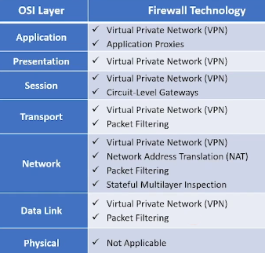

### Packet Filtering firewalls

Work at the **network level (OSI) / IP level (TCP/IP)**, they are usually part of a router.

Each packet is compared with a *set of criteria* before it is forwarded; traffic is filtered base on **specific rules**, for example source, destination IP addresses.

### Circuit level Gateways

Work at the **session level (OSI) / TCP layer (TCP/IP)**, they *monitor TCP handshakes* between packets to determine whether a *request session is legitimate or not*.

Information passed to a remote computer appears to have originated from the gateway.

Traffic is filtered on **specific session rules**.

### Application level Gateways

Can filter packets at the **application level**, they can filter *application-specific command* such as *http:post* and *get* or *specific protocols*. We can decide to filter the traffic based on rules about protocols or commands.

### Stateful Multilayer inspection firewalls

**Combines the aspects of the previously described technologies.**

They are expensive, because they require competent personnel that have to administrate the device used for filter the traffic at *three levels*; Filter based on a wide range of specified applications, sessions and / or filtering rules.

### Application Proxy

Works as a proxy server and **filters connections** for specific services; It filters connections based on **services** and **protocols**.

*A DNS proxy will only allow DNS traffic to pass through.*

---

# Next Generation Firewall

It is a **third-generation firewall technology** that moves beyond *port / protocol inspection*, can inspect traffic based on **packet content**.

## Technologies

### Network Address translation [NAT]

It separates IP addresses into *two sets* and enables the LAN to use these addresses for *internal* and *external traffic*. NAT will modify the packets the router sends.

Distinction between **private IP address** and **public IP address**, the *first* refers to the actual IP used from a host in the network; the *second* refers to the external IP address from which communications start;

- private IP are mapped to public IP

*It limits the number of public IP addresses* **(increase security = less hosts visible)**

### Virtual Private Network [VPN]

It is a **private network** constructed using public networks; It is used for the *secure transmission* of sensitive information over an untrusted network.

It is based on **encapsulation** and **encryption**, in order to create *dedicated connections* using a VPN tunnel in which communication is encrypted.

---

### Firewalls don't

* prevent the network from **backdoor attacks**

* protect the network from **insider attacks**

* do anything if the network design and configuration is faulty

* be an alternative to **antivirus** or **antimalware**

* prevent **new viruses**

* prevent **social engineering threats**

* prevent **passwords misuse**

* block attacks from higher level of protocol stack

### Secure Firewall implementation

* filter **unused** and common **vulnerable** ports

* create a **unique user ID** to run the firewall service (not root or admin)

* **deny all** and allow only the services required

* change all default passwords

* **limit running applications** in order to enhance the performances

* configure a **remote syslog server**

* monitor **firewall logs**

* investigate **suspicious log**

---

## Firewall implementation and deployment

* **PLANNING**
  
  Organizations must *plan* their **positioning** in advance

* **CONFIGURING**
  
  Hardware, software, **policy configuration**, implementing **logging** and **alerting** mechanisms

* **TESTING**
  
  Check if the **firewall rules** are set according to the actions performed by the firewall

* **DEPLOYING**
  
  A phased approach to deploy multiple firewalls on a network helps detect and *resolve issues* regarding **conflicting policies**

* **MANAGING AND MAINTAINING**
  
  Firewall **architecture**, **policies**, software and other components deployed on the network must be maintaining

---

# Host-based Firewall protection

## Iptables

It is a built-in firewall utility for *Linux OS*.

* **Filter non TCP packets**
  
  `iptables -A INPUT -p tcp ! --syn m state --state NEW -j DROP`

* **Blocking XMAS scan attack**
  
  *"Send XMAS packets during port scanning, in order to detect open ports"*
  
  `iptables -A INPUT -p tcp --tcp-flags ALL -j DROP`

* **Drop any NULL packets**
  
  `iptables -A INPUT -f -j DROP`

* **Drop any fragmented packets**
  
  `iptables -A INPUT -f -j DROP`

* **List existing rules**
  
  `iptables -L -n -v`

* **Block specific IP**
  
  `iptables -A INPUT -s <IP-ADDR> -j DROP`

---

---

# Intrusion Detection and Prevention System [IDS / IPS]

It is a *network security appliance* that **inspects all inbound and outbound traffic** for suspicious patterns that might indicate a network or system security breach.

If any pattern is recognized, the IDS will **alert** the administrator.

IDS checks the network traffic for **signatures** that match *known intrusion patterns* and triggers an alarm.

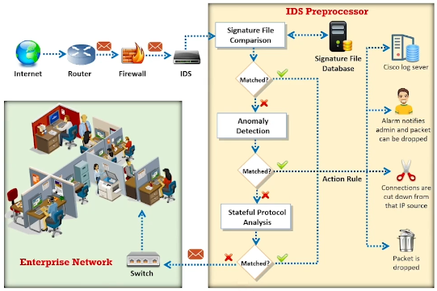

**IDS** works from *inside the network* (behind the firewall) != firewall that looks outside the network.

## Signature recognition

Also known as misuse detection, tries to *identify events* that indicate an abuse of a system or network resource.

This method uses *string comparison* operations to compare **ongoing activity** and looks for matches with the known signatures.

**+** Less false alarms

**+** Fast

**-** Detects only known threats

**-** Cannot detect variants of known threats

---

## Anomaly detection

It detects the intrusion based on *fixed behavioral characteristics* of the users and components in a computer system

This method monitors the typical activity for a particular time interval and then builds the **statistics fro the network traffic** (bandwidth usage, failed logon attempts, processor utilization ...)

**+** Identifies abnormal behavior

**+** Information acquired are used to *define the signatures for Signature detection*

**-** More false alarms

**-** Build up an extensive set of system events in order to characterize normal behavior patterns

---

## Approach-based / Stateful protocol detection

*Compares observed events* with predetermined profiles based on accepted definition of **benign activity for each protocol** to identify any **deviations** of the protocol state.

Variances in command length, min max values for attributes and other anomalies; for any protocol performing authentication, IDS/IPS will keep track of the *authenticator* being used for each session.

**+** Can identify strange sequence of commands

---

---

## Protection-based IDS

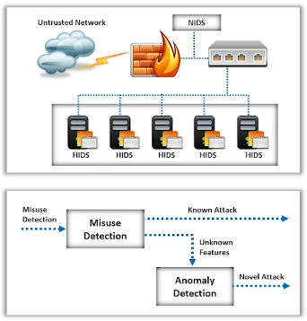

* **Network intrusion detection system [NIDS]**
  
  It protects the network **+ low false-positive rate**

* **Host intrusion detection system [HIDS]**
  
  It protects the host **+ anomaly-based detection**

* **Hybrid intrusion detection system [Hybrid IDS]**
  
  It protects the network and the host

---

## Structure-based IDS

* **Centralized IDS**
  
  Data are shipped to a *central location* for analysis

* **Decentralized IDS**
  
  Several IDS are *deployed* over a large network and each IDS communicates with each other for traffic analysis

---

## Analysis Timing-based IDS

Analysis time is a **span of time elapsed** between the events occurring and the analysis of those events

* **Interval-based IDS**
  
  The *information about an intrusion* is **stored and forwarded**, it performs analysis on the detected intrusion *offline*

* **Real-Time-based IDS**
  
  The *information about an intrusion* **flows continuously** from monitoring points to analysis engines. The analysis on the detected intrusion is performed *on the fly*

---

## Source Data analysis-based IDS

An IDS uses data and sources such as **audit trail** and network packets to detect intrusions

* **Intrusion detection using Audit Trails**
  
  Audit trails help the IDS detect *performance problems, security violations and flaws in applications*

* **Intrusion detection using Network Packets**
  
  Capturing and Analyzing network packets help an IDS detect *well-known attacks*

---

---

## Intrusion indicators

### File System intrusions

The presence of *new* or *unfamiliar* files or programs; Unexplained *changes* in a file's size or permissions. Missing files or *rogue* files that do not correspond to the master list of signed files.

### Network intrusions

Connections from *unusual locations* and repeated *login attempts*; Repeated probes of available services on the machine and a sudden *influx of log data*.

### System intrusion

*Incomplete*, *Missing* or with *incorrect permissions* or *ownership* logs; Unfamiliar processes or slow system performance; Strange modifications to system software and configuration files.

---

### Active IDS

**DETECTS**  and **RESPONDS** to detected intrusions

### Passive IDS

**DETECTS** intrusions

---

---

## IDS Components

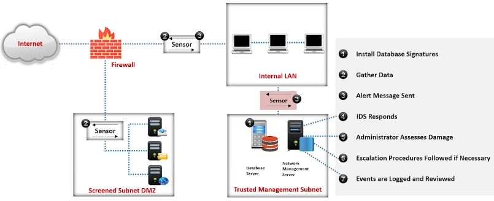

### Network sensors

Are **HW** or **SW** components that **monitor traffic** and **trigger alarms** if any abnormal activity is detected. Network sensors should be placed and located at *common entry points*.

*"Gateways, between LANs, VPNs, sides of firewall and remote access servers"*

### Alert systems

Sends an **alert message** when an anomaly or misuse is detected.

### Command console (Sguil)

It runs on a *separate system* that is dedicated to the IDS.

It provides a user interface to an administrator for the purpose of *receiving* and *analyzing* security events, alert messages and log files. It **evaluates security events** from different security devices.

*"Must be installed on a **dedicated** computer system!"*

### Response system

Issues countermeasures against any intrusion that is detected.

You also need to be involved in the decision during incident response and should have the ability to respond on your own. You have to make decisions on how to deal with *false positives* and when a response needs escalation.

### Attack signatures database

**IDS does not make decisions** but maintain a database of attack signatures and patterns. Network traffic is compared against these known attack signatures.

**IDS will raise alert and block the traffic** if there is a match.

---

---

# Intrusion detection Tools

## Snort

It is a *network intrusion detection system*, capable of performing real-time **traffic analysis and packet logging on IP networks**.

`snort`

It is used to detect various attacks and probes such as buffer overflows, stealth port scans and OS fingerprinting attempts.

## Suricata

It is a robust *network threat detection engine* capable of **real-time IDS**, **inline IPS**, **network security monitoring** and **offline pcap processing** (*we can pass wireshark files to be processed*).

---

---

# Honeypot

It is an information system resource that is expressly *set up to attract and trap people* who attempt to penetrate. It has no authorized activity, does not have any production value, and any traffic to it is likely to be a probe, attack or compromise.

It can log port access attempts or monitor an attacker's keystrokes.

### Low-interaction honeypots

These honeypots simulate only a **limited number of services** and applications of a target system or network

### Medium-interaction honeypots

These honeypots simulate a **real operating system**, applications, and services of a target network

### High-interaction honeypots

These honeypots simulate **all services** and applications of a target network

### Pure honeypots

These honeypots emulate the **real production network** of a target organization

* **Production honeypots**
  
  Are deployed inside the production network of the organization along with other production servers; They also help to find out *internal flaws* and *attackers within an organization*

* **Research honeypots**
  
  Are *high-interaction* honeypots primarily deployed by research institutes, governments, or military organizations to gain detailed knowledge about the actions of intruder

---

## Honeypot classification

### Malware honeypots

Are used to trap malware campaigns or malware attempts over the network infrastructure

### Database honeypots

Employ fake databases that are vulnerable to perform database-related attacks such as SQL injection and database enumeration

### Spam honeypots

Specifically target spammers who abuse vulnerable resources such as *open mail relays* and *open proxies*

### Email honeypots

Fake email addresses that are specifically used to *attract fake and malicious emails* from adversaries

### Spider honeypots

Specifically designed to **trap web crawlers** and spiders

### Honeynets

Networks of honeypots which are very effective in determining the entire capabilities of the adversaries

---

### Common Honeypot tools

* `HoneyBOT`

* `KFSensor`

* `MongoDB-HoneyProxy`

* `Modern Honey Network`

* `ESPort`

* `HoneyPy`

---

---

# Proxy server

A proxy server is a **dedicated computer**, or a software system *virtually* located between a client and the actual server; It is a **sentinel** between an internal network and the open internet.

It serves client requests on **behalf of actual servers**, thereby preventing actual servers from *exposing themselves* to the outside world; it provides an additional layer of defense to the network and can protect against certain operating system and web server specific attacks.

**+** privacy of client devices

**+** advanced logging capabilities

**+** hides internal IPs

### How it works?

1. *Internal host requests* to access a web site

2. The request enters the *proxy server which examines the header and packet content* based on the rule base

3. *Server reconstructs the data packet with different source IP*

4. *Proxy server transmits the packet* to target address

5. If the data packet is returned, it is again sent to the proxy server to check the rule base

6. The returned *packet is reconstructed* by the proxy server and is sent to the source computer

## Proxy servers vs Packet filters

| Proxy                                                    | Filter                                                    |
| -------------------------------------------------------- | --------------------------------------------------------- |
| *examines* the **data payload**                          | *examines* the **routing information**                    |
| creates detailed *log file*                              | logs only the *header information*                        |
| *restructures* the packet with new **IP**                | **allows** or **blocks** the data                         |
| if it *fails* all the network communications would cease | if it *fails* call packets may be allowed to pass through |

## Types of proxies

### Transparent proxy

It is a proxy through which a **client system connects** to a server without its knowledge; It is configured to be entirely *invisible* to an end user.

All the web clients must be *configured manually*.

### Non-Transparent proxy

Require **client software to be configured** to use the proxy server; The client is made aware of the proxy's existence.

### SOCKS proxy

It is an **Internet Engineering Task Force [IETF]** standard.

It is a proxy server that *does not have* special caching abilities of a caching HTTP proxy server; ***Does not allow*** external network components to **collect information** on the client that generated request.

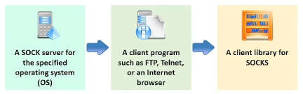

### Anonymous proxy

It is a proxy that **does not transfer information** about IP address of its user, thereby hiding information about user and their surfing interests.

**+** Users can surf the internet privately

**+** Users can access censored websites

**-** Speed of loading web pages can be slower

**-** In some places are illegal  

### Reverse proxy

It is usually **situated closer to the servers** and will only return a configured set of resources; It can optimize content by compressing it to speed up loading, the client is unaware of the presence.

It is an *intermediate server* that is located between a client and the actual web server.

*"The authentication process can be done by the proxy and presented to the actual server"*

---

## Limitations of proxy servers

* A proxy *not properly secured* can become a **point of failure**

* Every proxy needs to be configured for the service it provides

* Changing the default settings can result in bad function

* Proxies have the **reroute information**, thus web pages can sometimes load slowly

* When **bypassing suspicious software** some elements of a page may not load

---

---

# Virtual Private Network [VPN]

VPNs are used to securely communicate with different computers over insecure channels; It uses the internet and ensures secure communication to distant offices or users within the enterprise's network.

1. A client willing to connect to a company's network initially connects to the internet

2. The client *initiates* a **VPN connection** with the company's server

3. Before establishing a connection, end points must be **authenticated** through passwords, biometrics, personal data, or any combination of these

4. Once the connection is established, the client ca *securely access* the company network

## Components

* **VPN client**, sends requests encrypted

* **Network Access Server [NAS]**, forwards the requests

* **VPN server**, decrypt the requests and encrypts requests from the network

* **VPN protocol**, protocol used to tunnel requests

### VPN Concentrators

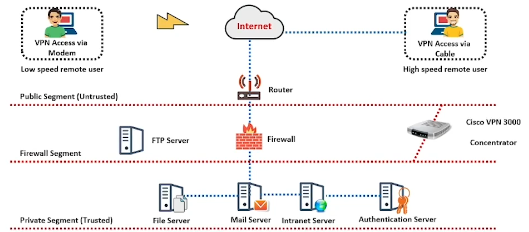

It is a network device that sits at the edge of the network, it acts as a VPN router which is generally used to create a *remote access* or *site-to-site* VPN.

It uses **tunneling protocols** to *negotiate security parameters*, **create and manage tunnels**, encapsulate, transmit, or receive packets through the tunnel, and de-encapsulate them.

It is a **bi-directional tunnel endpoint**

*"It is the master mind of VPN connections"*

----

## Types

### Client-to-Site (Remote-access) VPN

It allows individual hosts or client to establish *secure connections* to a company's network over the internet. Each host uses a VPN client SW of a web-based client.

The VPN **encrypts** the data-packets that are forwarded over the internet to the *VPN gateway* at the edge of the target network, using the software installed on the client's machine.

A **VPN gateway** receives the packets and then closes the connection to the VPN after the transfer is complete.

### Site-to-Site VPN

It extends the company's network, allows access of an organization's network resources from different locations; It connects a branch of remote office network to the company's headquarters network.

It is called **LAN-to-LAN** or **L2L VPNs**

Can be classified in:

* **intranet-based**, VPN connectivity is between sites of a *single organization*

* **extranet-based**, VPN connectivity is between *different organizations*

### Hardware VPN

A dedicated VPN appliance is used to connect *routers* and *gateways* to ensure communication over an insecure channel; It is designated to serve as a VPN endpoint and can connect *multiple LANs*.

### Software VPN

VPN software is installed and configured on routers, servers, and firewalls or as a gateway that functions as a VPN

**+** No extra devices needed

**+** Easy and low-cost way to deploy a VPN

**-** Extra processing

**-** Less secure

---

## Authentication

User must be authenticated in order to use VPN and its resources; It uses **digital certificates** to authenticate users.

Common authentication techniques:

* IPSec

* MS-CHAP *"not really good"*

* Kerberos

## Encryption

Packet sent over a VPN are *encrypted* to maintain the *confidentially of the information*; Packets are read by decrypting with the encryption key from the sender.

Common VPN encryption technologies:

* Triple Data encryption standard [3DES] *"useless, vulnerable"*

* Secure Socket Layer [SSL]

* Open VPN

*"Using Diffie Helman (or others) the organization provides the encryption key to the client (asymmetric key); all of this is certified from a Certificate Authority and certificates are managed by certificate server in the organization. In this way user can send encrypted messages and can decrypt organization's messages"*

## Encapsulation

Packets over a VPN are ***enclosed* within another packet** which has a *different IP source and destination*; Concealing the source and destination of the packets protects the integrity of the data sent.

Most common protocols:

* Point-to-Point Tunneling protocol [PPTP]

* Layer 2 Tunneling protocol [L2TP]

* Secure Shell [SSH]

* Socket Secure [SOCKS]

---

## VPN technologies

### Trusted VPN

**Were used** before the internet became universal.

Organization's knows and control the pathway for their transmission, they leased circuits from a communications provider and used them the same way as *physical cables in a private LAN*.

*"ATM circuits, frame-relay circuits, Multiprotocol Label Switching [MPLS] are used to implement trusted VPNs"*

### Secure VPN

Vendors created a protocol which encrypts the traffic at the originating computer and decrypts at the receiving computer; the *encrypted* traffic acts as a *tunnel* between two networks.

### Hybrid VPN

***"A secure VPN is part of a trusted VPN"***

The secure part of the hybrid VPN is administrated by the customer or the provider, who has provided trusted part of the hybrid VPN.

---

## VPN Topologies

A VPN topology specifies **how the peers and networks within a VPN are connected.**

### Hub-and-Spoke VPN topology

**Each individual spoke** connected to the remote office **is communicated** securely with the *central device (hub)*; a separate and secure tunnel is established between the hub and each individual spoke.

### Point-to-Point VPN topology

Offices at different locations can directly communicate with each other **without any IPsec failover** ; this topology treats two **end points == two peer devices** participating in communication.

Only regular IPsec or IPsec/GRE is assigned for the tunnel, as any of the peer devices can initiate the communication.

### Full Mesh VPN topology

This topology is suitable for *complicated networks* where all peers communicate with one another; Device to Device communication in a network takes place with a unique IPsec-tunnel.

A **peer-to-peer connection is established between each device**, preventing a bottleneck at the VPN gateway and saving encryption/decryption overhead.

**+** Redundancy

### Star VPN topology

This topology allows remote branches to *securely communicate* with corporate headquarters.

**Branches are not connected, they are connected to the central site.**

**+** Fault isolation, a compromised branch is not a problem

**-** If the central site fails, everything fails

---

# VPN Security

## Firewalls

Firewalls are the barrier VPN and the internet.

Before implementing a VPN, ensure that a good firewall is in place; should be configured to **restrict open ports**, and the types of **packets** and **protocols** allowed to pass.

## IPSec server

The IPSec server enhances VPN security through the use of **strong encryption algorithms** and **authentication**.

IPSec server contains 2 encryption modes:

* **Tunnel mode**
  
  Both **header** and **payload** of each packet is encrypted

* **Transport mode**
  
  Only **payload** of each packet is encrypted

## AAA server

It is used to establish secure access in a remote-access VPN environment.

* **Authentication**, "Who are you?"

* **Authorization**, "What are you allowed to do?"

* **Accounting**, "What do you actually do?"

## Remote Access Dial-In User Service [RADIUS]

Remote access dial-in user service is the simplest way to use *centralized authentication in VPNs*; It is a **software application** that runs on a server and has access to all users in the domain.

RADIUS manages both the **user authentication** and **authorization**, this *reduces the total cost of ownership* by **managing credentials** from a central location.

When a user wants to connect to the VPN server contacts the RADIUS server who then authenticates the user through a **Windows domain** using both a username and a password, if correct, they have ***"dial-in access granted"***.

---

# Security Incident and Event Management [SIEM]

SIEM performs **real-time Security Operations Center [SOC]** functions like identifying, monitoring, recording, auditing, and analyzing security incidents.

It provides security by **tracking suspicious end-user behavior** activities within real-time IT environment.

It provides security management services combining:

* **Security Information Management [SIM]**, supports permanent storage, analysis and reporting of log data + file integrity monitoring

* **Security Event Management [SEM]**, deal with real-time monitoring, correlation of events, notifications and console views

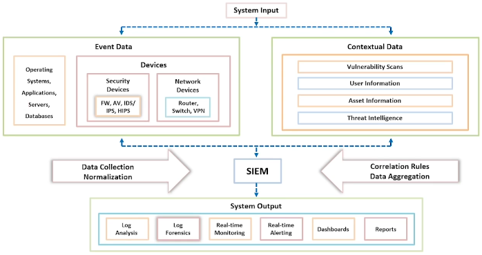

---

# User Behavior Analytics [UBA]

UBa is the process of **tracking user behavior** to detect malicious attacks, potential threats, and financial fraud; it provides *advanced threat detection* in an organization to monitor specific behavioral characteristics of employees.

***"Identifies variations in traffic patterns, caused by user behavior"***

---

---

# Virtualization

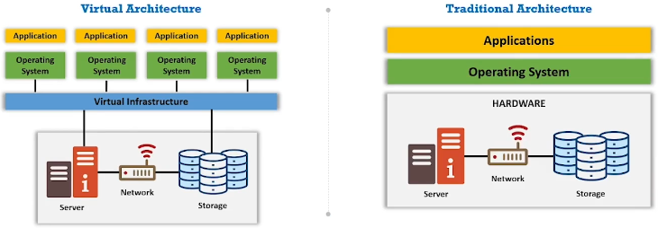

The virtualization framework divides the *physical resources* from which are traditionally bound to hardware, into **multiple individual simulated environments**.

*"We can run multiple isolated services on a single server"*

## Components

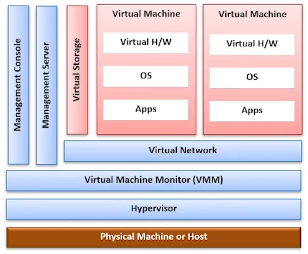

### Hypervisor / Virtual Machine MONITOR [VMM]

An *application* or *firmware* that enables multiple guest operating systems to share a host's hardware resources

### Guest machine / Virtual Machine

*Independent* instance of an operating system **created by virtual machine monitor**

### Host machine / Physical Machine

*Real physical machine* that provides computing resources to support virtual machines

### Management Server

*Virtualization platform* components are used to directly **manage** the virtual machines

### Management Console

*Interface* used to access, configure, and manage the virtualization product

---

# Containers

Virtualization based on an operating system, in which the **kernel's operating system functionality is replicated on multiple instances** of isolated user space, called containers, software containers or virtualization engines.

**Containers as a service [CaaS]** includes the *virtualization of containers and container management* through **orchestrators**.

* **Container Engine**
  
  Managed environment for deploying containerized applications

* **Container Orchestration**
  
  An automated process of managing the lifecycles of software containers and their dynamic environment

*"Known orchestrator software, Docker Swarm, OpenShift and Kubernetes"*

## Containers Architecture

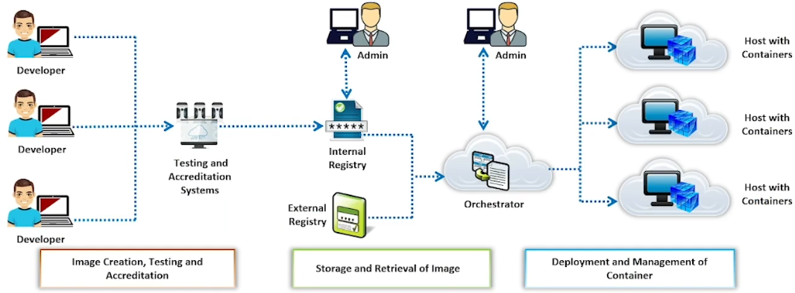

## Types of containers

### OS containers

Containers used as an operating system and run **multiple services**

*"LXC, OpenVZ, Linux Vserver ..."*

### Application containers

Containers used to run a **single application**; contains the application, its dependencies, and hardware requirement file

*"Docker, Rocket"*

## Container Vs Virtual Machine

| Container                            | Virtual Machine                             |
| ------------------------------------ | ------------------------------------------- |
| Provides *OS-level virtualization*   | Provides *hardware-level virtualization*    |
| Lightweight                          | Heavyweight                                 |
| All containers **share the host OS** | Each virtual machine runs in **its own OS** |
| Requires less memory space           | Allocates required memory                   |
| Process-level isolation              | Fully isolated                              |

---

## Docker

It is an open source technology used for developing, packaging, and running applications and all its dependencies in the form of containers, to ensure that the application works in a seamless environment.

Docker provides a **Platform-as-a-Service [PaaS]** through **OS-level virtualization** and delivers containerized software packages.

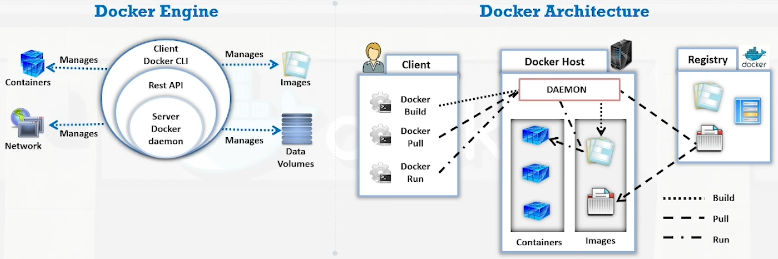

### Docker networking

Docker **connects multiple containers** and services or other non-Docker workloads together.

The docker networking architecture is developed on a set of interfaces known as the **Container Network Model [CNM]**, allowing application portability across heterogeneous infrastructures.

---

## Kubernetes

It is an open-source, portable, extensible, orchestration platform developed by Google for **managing containerized applications** and microservices.

Kubernetes provides a resilient framework for managing distributed containers, generating deployment patterns, and performing failover and redundancy.

---

## Containers Threats

### Image threats

An image can be faulty (configuration defects) or vulnerable; Can be embedded with malware or can have *clear text secrets*

### Registry threats

Old images in registries can be a problem. We must check for *insecure connections* to registries, and *insufficient authentication and authorization*

### Container threats

There can be vulnerabilities within the runtime software or bounded with insecure container runtime configurations

### Host OS threats

Large surface attacks and has a shared kernel; Host file system and components have vulnerabilities

### Orchestrator threats

Can be accessed in an unauthorized way and the inter-container network traffic is poorly separated; The administrative access can be unbounded and there is a mixing of workload sensitivity levels.

Each node must be trustworthy.

---

## OS Virtualization Security Best Practices

1. Regularly **monitor the CVEs** of the container runtime and remediate, if any vulnerabilities are detected

2. Employ **app-aware tools to monitor container network** interfaces, network traffic, and network anomalies

3. Configure applications to **run as normal users** to prevent privilege escalation

4. Configure the **host's root file system in READ ONLY mode**

5. Employ **application security scanning tools** to protect containers from malicious software

6. Perform regular **scanning of the images** in the repository to *identify vulnerabilities or misconfigurations*

## Docker Security Best Practices

1. Avoid exposing the Docker daemon socket

2. Always use **trusted Docker images** only

3. regularly patch the host OS and Docker with the latest security updates

4. Limit the capabilities by allowing access only to the features required by the container

5. Use Linux security models such as *seccomp, AppArmor and SELinux* to gain fine-grained control over processes

6. Enable **read-only mode on file systems and volumes** by setting the `--read-only` mode

## Kubernetes Security Best Practices

1. Ensure proper validation of file contents and their path at every stage of processing

2. Implement the configuration method for the credential paths

3. Raise errors explicitly after each step of a compound operation

4. Use the well-tested JSON library an type structures for constructing JSON objects

5. Never use compound shell commands without proper validations

6. Use common parsing functions such ad ParsePort across the codebase to increase code readability

---

---

# Cloud Security

*"The cloud section is already covered in the [AWS repository](https://github.com/RiccardoRobb/AWS-Academy-Cloud-Foundations)"*

1. Cloud security and compliance are the **shared responsibility** of the cloud provider and consumer

2. According to the selected cloud module, security responsibilities are divided based on the shared responsibility model

3. If the **consumer does not secure their functions**, the entire cloud security model will **fail**

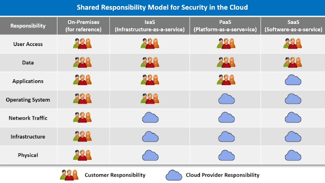

## Customer

Cloud service customers are responsible for:

* User security and monitoring **Identity and Access Management [IAM]**

* Information security-data **encryption and key management**

* Application-level security

* Data storage security

* **Monitoring, logging, and compliance**

*"Read the End-User License Agreement [EULA]"*

## Providers

Cloud service providers are responsible for **securing the shared infrastructure**, including routers, switches, load balancers, firewalls, hypervisors, storage networks, management consoles, DNS, directory services, and cloud API

---

## Elements of Cloud Security

### Identity and Access Management [IAM]

IAM is the management of *digital identities of users and their rights* to access cloud resources; includes creating, managing, and removing digital identities, as well as the authorization of users

### Compliance

A clear idea about the **regulation standards** that an organization wants to comply with along with its associated requirements allows organizations benefits from the business agility and growth.

* Know the jurisdictions of an organization, industry, or activities employed by the organization to conduct business

* Conduct regular compliance risk assessments

* Monitor and Auditing the organization compliance program

### Data Storage

techniques used are: local data encryption, key management, strong password management, periodic security assessment of data security controls, cloud data backup, etc ...

### Monitoring

It is required to manage cloud-based services, applications, and infrastructure.

Activity monitoring should observe the activities like data replication, data file name changes, data file classification changes, data ownership changes to monitor unauthorized data access, etc ...

---

## NIST recommendations

1. **Assess the risk** posed to the client's data, software and infrastructure

2. Select an appropriate deployment model

3. Ensure **audit procedures** are in place for data protection and software isolation

4. **Renew Service level agreement [SLA] in case of security gaps**

5. Establish appropriate **incident detection** and **reporting mechanisms**

6. Analyze what are the *security objectives* of the organization

7. Enquire about **who is responsible for data privacy and security issues** in the cloud

---

---

# Wireless Network Security

## Basic terminology:

* **GSM**, universal system used for mobile transportation for wireless networks *"SIM cards"*

* **Bandwidth**, the amount of information that may be broadcast over a connection

* **Access Point [AP]**, used to connect wireless devices to a wireless/wired network
  
  * **Association**, the process of connecting a wireless device to an AP
  
  * **BSSID**, MAC address of an AP that has set up a *Basic Service Set [BSS]*

* **IMS band**, a set of frequencies for the international industrial, scientific, and medical communities

* **Hotspot**, a place where a wireless network is available for public use

* **Service Set Identifier [SSID]**, a unique identifier *32 alphanumeric characters* given ti a wireless local area network [LAN] *"wi-fi name"*

* **Orthogonal Frequency-division Multiplexing [OFDM]**, method of encoding digital data on multiple carrier frequencies *"transporting wi-fi name"*
  
  * **Multiple input, Multiple output OFDM [MIMO-OFDM]**, an air interface for *4G* and *5G* broadband wireless communications

* **Direct-sequence Spread Spectrum [DSSS]**, an original data signal multiplied with a pseudo-random noise spreading the code

* **Frequency-hopping Spread Spectrum [FHSS]**, a method of transmitting radio signals by rapidly switching a carrier among many frequency channels

## Types:

* **Wi-Fi**, it uses radio waves or microwaves to allow electronic devices to exchange data or connect to the internet

* **Bluetooth**, data is transmitted between cell phones, computers, and other networking devices over short distances

* **RFID**, it uses radio frequency to transfer data for automatic identification and for tracking tags attached to objects

* **WiMAX**, it uses long distance wireless networking and high-speed internet and belongs to the IEEE 802.16 family of wireless networking standards

## Topologies:

### Ad-hoc Standalone Network architecture (Independent Basic Service Set [IBSS])

Devices exchange information with each other similar to that in a peer-to-peer communication mode **without the need of an AP for communication**. Devices must be configured with *same channel name* and *SSID* in order to activate the connections

### Infrastructure Network topology (Centrally Coordinated Architecture/Basic Service Set [BSS])

Devices in the wireless network are connected **through an AP**; an AP connects to the internet via a modem *"every modem can have multiple APs"*

## Components

### Access point [AP]

It is an hardware device that allows wireless communication devices to connect to a wireless network via wireless standards such as Bluetooth, Wi-Fi, etc ...

### Wireless Card [NIC]

Systems connected to the wireless network require a network interface cards to establish a standard **ethernet connection**

### Wireless Modem

It is a device that receives and transmits *network signals* to other units without requiring physical cabling

### Wireless Bridge

It **connects multiple LANs** at the *Medium Access Control [MAC]* layer and is separated either logically or physically. It is used for increasing the coverage area of the wireless network

### Wireless Repeater

**Retransmits** the existing signal captured from a wireless router or AP to create a new network

### Wireless Router

Performs the functions of a router as well as a wireless AP and provides internet access to various devices

### Wireless Gateways

**Routes data packets** and functions as a wireless AP. An internet connection can be shared between multiple stations

---

## Types of Wireless Encryption

* **802.11i**, an IEEE amendment that specifies security mechanisms for 802.11 wireless networks

* **WEP**, an encryption algorithm for IEEE 802.11 wireless networks

* **EAP**, supports multiple authentication methods, such as *token cards, Kerberos, and certificates*

* **LEAP**, a proprietary version of EAP developed by Cisco

* **WPA**, an advanced wireless connection encryption protocol using **TKIP** and **MIC** to provide stronger encryption and authentication

* **WPA2**, an upgrade to WPA using *AES* and *CCMP* for wireless data encryption

* **AES**, a *symmetric key* encryption, used in WPA2 as *replacement for TKIP*

* **CCMP**, an encryption protocol used in WAP2 for stronger encryption and authentication

* **WPA2 Enterprise**, integrates *EAP* standards with WPA2 encryption

* **RADIUS**, a **centralized authentication and authorization** management system

* **PEAP**, a protocol that encapsulates the EAP within an encrypted and authenticated *transport layer security [TLS]* tunnel

* **WPA3**, a third-generation Wi-Fi security protocol that uses GCMP-256 for ecnryption and HMAC-SHA-384 for authentication

---

## Encryptions comparison

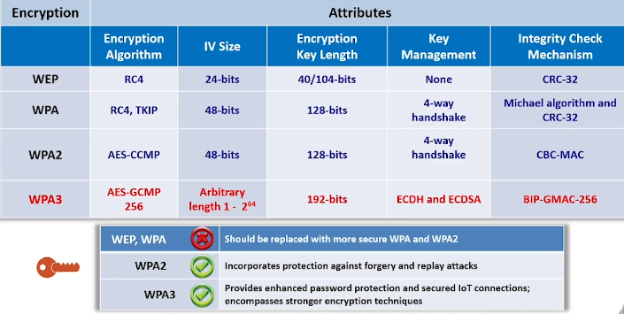

---

## Wi-Fi Authentication methods

### Open System auth

Any wireless device can be authenticated with the AP, thus allowing the device to transmit data only *when its WEP key matches to that of the AP*

### Shared Key auth

The station and AP use the **same WEP key** to provide authentication, which means that this key should be enabled and configures manually on both the AP and client

### Centralized auth Server

Using RADIUS or other types of systems, you need to be authorized by the server in order to be authenticated by the AP

---

*"Don't use default passwords or crackable ones, configure only HTTPS communication only, disable remote access, enable logging and disable UPnP for a good wireless router configuration"*

---

---
